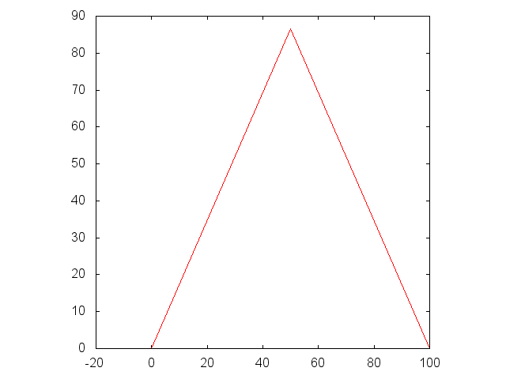
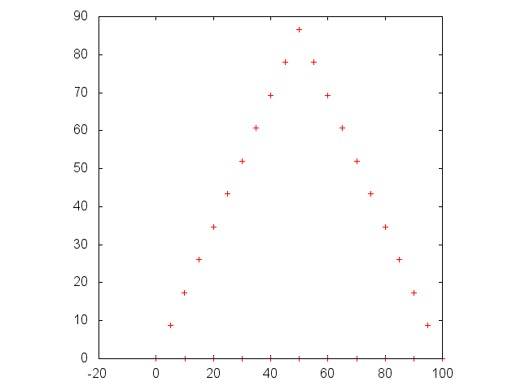
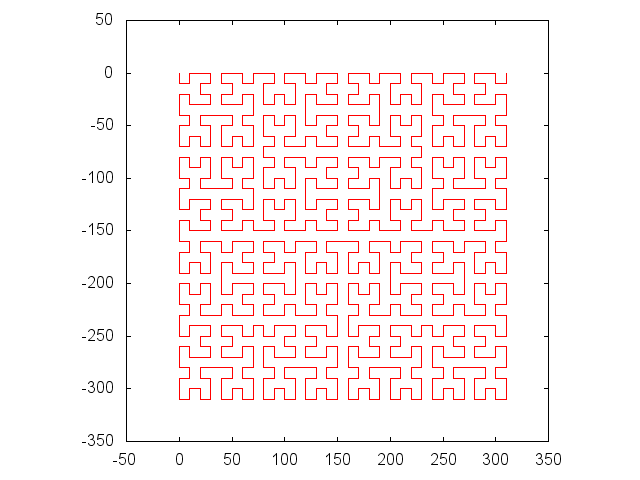
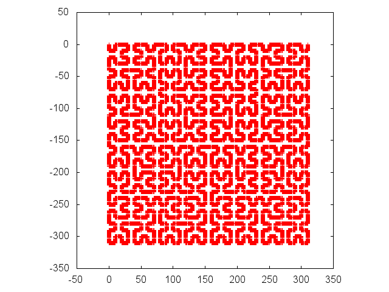
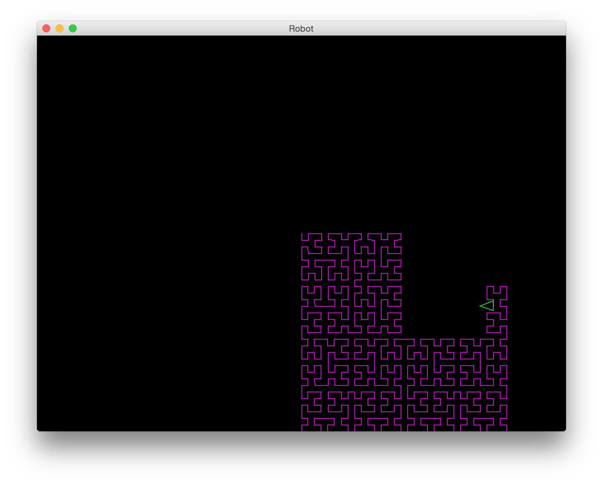

------------------------------------------------------------------------

[]()

オブジェクト指向プログラミング実習 課題３
=========================================

### この課題をクリアするには

1.  (まず課題２を解いて下さい．)
2.  チーム全員がこのページの内容を理解すること．
3.  チームを代表して誰かメンバーがプロジェクト課題３を提出すること．
4.  チーム全員がmanabaの「課題２・３確認ドリル」を何回か受験すること．
5.  最後に，チーム全員で教員のところに来て質疑セッションを行うこと．

------------------------------------------------------------------------

トピック：抽象クラス
--------------------

抽象クラスは，インスタンス(具体的なオブジェクト)を作れないクラスのことである．
抽象クラスは，抽象メソッド(メソッド名・返す型・引数の仕様だけがあって，
本体の具体的なプログラムがないメソッド)を持つことができる．

抽象クラスの主な目的は，具体的なサブクラスを定義するための先祖を定義しておくことである．
前回は、グラフを描く機能をもったクラスを継承して機能を変更していたが、
こんどはグラフを描くクラスと、グラフの形を指定するクラスを分けてみる。

#### 例題1: 図形を表す抽象クラスShapeと，具体的なサブクラスRectShape

``

``` {.program}
// ファイルShape.java
public abstract class Shape {
    // 抽象メソッド inside(x, y)
    // (x, y)が図形の内側ならtrueを，そうでなければfalseを返すものとする．
    // ちょうど境界線上は内側とみなす約束とする．
    abstract boolean inside(double x, double y); 

    // draw(x1, x2, xstep,  y1, y2, ystep)
    // x座標: x1からx2までxstep刻み
    // y座標: y1からy2までystep刻み
    // (x, y)が図形の内側なら*を，そうでなければ空白を書く．
    void draw(double x1, double x2, double xstep,
              double y1, double y2, double ystep) {
        for (double y = y2; y >= y1; y -= ystep) {
            for (double x = x1; x <= x2; x += xstep) {
                if (inside(x, y)) {
                    System.out.print("*");
                } else {
                    System.out.print(" ");
                }
            }
            System.out.println();
        }
    }
}
class RectShape extends Shape {
    double left, bottom, width, height;
    RectShape(double left, double bottom, double width, double height) {
        this.left = left;
        this.bottom = bottom;
        this.width = width;
        this.height = height;
    }
    boolean inside(double x, double y) {
        return left <= x && x <= left + width &&
            bottom <= y && y <= bottom + height;
    }
}
class RectTest {
    public static void main(String[] args) {
        RectShape r1 = new RectShape(2.0, 2.0, 5.0, 3.0);
        RectShape r2 = new RectShape(1.0, 1.0, 4.0, 3.5);
        r1.draw(0.0, 7.0, 0.25,
                0.0, 6.0, 0.5);
        System.out.println("------------------------------------------------");
        r2.draw(0.0, 7.0, 0.25,
                0.0, 6.0, 0.5);
    }
}
```

#### 実行例:

(**太字**が入力) ``

``` {.interaction}
borage36:~ maeda$ java RectTest
                             
                             
        *********************
        *********************
        *********************
        *********************
        *********************
        *********************
        *********************
                             
                             
                             
                             
------------------------------------------------
                             
                             
                             
    *****************        
    *****************        
    *****************        
    *****************        
    *****************        
    *****************        
    *****************        
    *****************        
                             
                             
borage36:~ maeda$
```

### 設問1: 円

上を参考に、円を表すShapeのサブクラスCircleShapeを作りなさい．
CircleShapeのコンストラクタは，中心の座標を表すx0, y0と，
半径rを引数として受け取るものとする．

x, y, x0, y0, rを使ったboolean型の式を下の「式１」に
入れてプログラムを完成させなさい．

``

``` {.program}
// ファイルCircleShape.java
class CircleShape extends Shape {
    double x0, y0, r;  // 中心座標(x0, y0), 半径r
    CircleShape(double x0, double y0, double r) {
        this.x0 = x0;
        this.y0 = y0;
        this.r = r;
    }
    boolean inside(double x, double y) {
        return 「式１」;
    }
}


```

次のプログラムCircleTestを使って試しなさい． ``

``` {.program}
// ファイルCircleTest.java
class CircleTest {
    public static void main(String[] args) {
        CircleShape c = new CircleShape(5.0, 5.0, 3.0);
        c.draw(0.0, 10.0, 0.25,
               0.0, 10.0, 0.5);
    }
}
```

#### 実行例:

(**太字**が入力) ``

``` {.interaction}
borage36:~ maeda$ java CircleTest
                                         
                                         
                                         
                                         
                    *                    
              *************              
            *****************            
          *********************          
         ***********************         
         ***********************         
        *************************        
         ***********************         
         ***********************         
          *********************          
            *****************            
              *************              
                    *                    
                                         
                                         
                                         
                                         
borage36:~ maeda$ 
```

**CircleShape.java**を提出しなさい．

------------------------------------------------------------------------

### 設問2

同様に，コンストラクタが3つの引数a, b, cを受け取り， 放物線 a x^2^ + b x
+ c = y の下側(放物線上も含む)を表す図形
ParabolaShapeを作る．下の「プログラム２」に適切なプログラムを書きなさい．
クラスParabolaTestを用いて試しなさい． ``

``` {.program}
// ファイルParabolaShape.java
class ParabolaShape extends Shape {
    double a, b, c;  // a * x^2 + b * x + c =  y
    「プログラム２」
}

// ファイル ParabolaTest.java
class ParabolaTest {
    public static void main(String[] args) {
        ParabolaShape p = new ParabolaShape(-1, 6, -5);
        p.draw(0.0, 6.0, 0.15,
               0.0, 5.0, 0.3);
    }
}
```

#### 実行例:

(**太字**が入力) ``

``` {.interaction}
borage36:~ maeda$ java ParabolaTest
                                        
                                        
                                        
                                        
                  *****                 
                *********               
               ***********              
              *************             
             ***************            
            *****************           
           *******************          
          *********************         
          *********************         
         ***********************        
         ***********************        
        *************************       
        *************************       
borage36:~ maeda$
```

**ParabolaShape.java**を提出しなさい．

------------------------------------------------------------------------

トピック：インターフェース
--------------------------

インターフェースは，メソッドや変数を持ったクラスではなく，
「こういうメソッドを持っていること」という約束だけを表すものである．
新しいクラスを定義する際，スーパークラスは1個しか指定できないが，
インターフェースはいくつでも指定することができる． ``

*** 
追記 elect    
内部で抽象メソッドを宣言することができる    
1つのクラスは、複数のインターフェースを実装することができる    
インタフェースを継承した子インターフェースを定義できる    
インターフェースXの配列X[]型の変数を宣言することができる。     
***

``` {.program}
interface RobotView {
    public void turn(double oldHeading, double newHeading);
    public void move(double oldX, double oldY,
                     double newX, double newY);
}
```

RobotViewは，ロボットの状態が変化したという通知を受けて，
表示を行うオブジェクトのためのインターフェースである． ``

``` {.program}
public class RobotModel  {
    // ロボットの内部状態を表すデータ
    double x, y;    // 現在の座標．
    double heading; // 角度(0〜360)．0は東(右)，90は北(上)を表す．
    RobotView view;

    public RobotModel() {
        x = y = 0.0;
        heading = 0.0;
    }
    public void setView(RobotView view) {
        this.view = view;
    }
    public void setHeading(double heading) {
        view.turn(this.heading, heading);
        this.heading = heading;
    }
    public void turnLeft(double degree) {
        setHeading(heading + degree);
    }
    public void turnRight(double degree) {
        turnLeft(-degree);
    }
    public void moveTo(double x, double y) {
        view.move(this.x, this.y, x, y);
        this.x = x;
        this.y = y;
    }
    public void moveForward(double step) {
        double radian = heading / 180.0 * Math.PI;
        moveTo(this.x + Math.cos(radian) * step,
               this.y + Math.sin(radian) * step);
    }
}
```

RobotModelは，[以前](oo_basics.html#2)に出てきた
SimpleRobotを少し変更して，出力する機能を切り離してRobotViewに
任せるようにしたものである．ロボットの向きが変化するとviewのturnメソッドを，
位置が変化するとviewのmoveメソッドをそれぞれ呼び出して変更をviewに通知する．

### 設問3

RobotViewを実装(implements)したクラスSimpleViewを作り，
ロボットの位置が変化するたびに以前のSimpleRobotと同様 ``

``` {.interaction}
移動前のx座標  移動前のy座標
移動後のx座標  移動後のy座標
```

の2行を出力するようにしなさい． (turnメソッドの中身は空でよい．) ``

``` {.program}
public class SimpleViewTriangle {
    public static void main(String[] args) {
        RobotModel robot = new RobotModel();
        RobotView view = new SimpleView();
        robot.setView(view);
        for (int i = 0; i < 3; i++) {
            robot.moveForward(100);
            robot.turnLeft(120);
        }
    }
}
```

上のプログラムの結果を plot.sh スクリプトで gnuplot に与えると，
以前と同様の三角形が描画されるはずである．

#### 実行例:

(**太字**が入力) ``

``` {.interaction}
borage36:~ maeda$ java SimpleViewTriangle
0.0 0.0
100.0 0.0
100.0 0.0
50.00000000000002 86.60254037844388
50.00000000000002 86.60254037844388
-2.1316282072803006E-14 2.8421709430404007E-14
borage36:~ maeda$ java SimpleViewTriangle > tri.dat 
borage36:~ maeda$ ~maeda/oo/plot.sh tri.dat
```



SimpleView.javaを提出しなさい．

### 設問4

同じくRobotViewを実装(implements)したクラスDotViewを作り，
ロボットの位置が変化するたびに座標を出力しなさい．
ただし，線分の始点と終点だけを出力するのではなく，
線分の始点から終点までを，
等間隔に10個の区間に区切って，区間の区切りの点(両端を含む)を
描くようにしなさい． (turnメソッドの中身は空でよい．) ``

``` {.program}
public class DotViewTriangle {
    public static void main(String[] args) {
        RobotModel robot = new RobotModel();
        RobotView view = new DotView();
        robot.setView(view);
        for (int i = 0; i < 3; i++) {
            robot.moveForward(100);
            robot.turnLeft(120);
        }
    }
}
```

上のプログラムの結果を plot-dot.sh スクリプトで gnuplot に与えると，
下記のような三角形が描画されるようにする．

#### 実行例:

(**太字**が入力) ``

``` {.interaction}
borage36:~ maeda$ java DotViewTriangle
0.0 0.0
10.0 0.0
20.0 0.0
30.0 0.0
40.0 0.0
50.0 0.0
60.0 0.0
70.0 0.0
80.0 0.0
(略)
borage36:~ maeda$ java DotViewTriangle > tri-dot.dat 
borage36:~ maeda$ ~maeda/oo/plot-dot.sh tri-dot.dat
```



**DotView.javaを提出しなさい．**

トピック：実行時に振る舞いを切り替える
--------------------------------------

「だいたい同じだが，一部だけ変化する振る舞い」を実現するために，
よく用いられる方法として，以下の2つがある．

-   [GraphTemplate](inheritance.html#template)のように継承を用いて，
    親クラスとだいたい同じ動作を実現し，変更したい部分だけ子クラスでオーバーライドする．
-   変更する可能性のある部分を切り分けて，別のオブジェクトにしておき，
    共通のインターフェースを決めておく(たとえばRobotView)．
    このオブジェクトを取り替えることで，動作を変化ささせる．

一長一短があるが，後者の，複数のオブジェクトを組み合わせる
やり方(コンポジション)では，下記のように，プログラムの実行が始まった後で振る舞いを切り替えることが可能になる．
``

``` {.program}
// ファイル Hilbert.java
public class Hilbert {
    static RobotModel robot;
    static double step;
    static void hil(int level, double deg) {
        if (level > 0) {
            robot.turnRight(deg);
            hil(level - 1, -deg);
            robot.moveForward(step);
            robot.turnLeft(deg);
            hil(level - 1, deg);
            robot.moveForward(step);
            hil(level - 1, deg);
            robot.turnLeft(deg);
            robot.moveForward(step);
            hil(level - 1, -deg);
            robot.turnRight(deg);
        }
    }
    public static void main(String[] args) {
        robot = new RobotModel();
        step = 10;

        RobotView view = new SimpleView();
        if (args.length > 0) {
            if (args[0].equals("--dot")) {
                view = new DotView();
            } else if (args[0].equals("--screen")) {
                view = new ScreenView();
            }
        }
        robot.setView(view);

        hil(5, 90.0);
    }
}
```

**上のプログラムのmainメソッドの内容について，
よく理解して，教員からの質問に答えられるようにしておくこと．**
(hilメソッドについては詳しく理解できなくてもかまわない．)
***
追記: elect    
equalsでなく、==で比較するようにすると、必ずSimpleViewが選ばれてしまう      
***

#### (以下は参考情報)

実際に試すには，まず，SimpleViewとDotViewが入っているディレクトリで，
このプログラムを下記のようにコンパイルする． ``

``` {.interaction}
borage36:~ maeda$ javac -cp ~maeda/oo:. Hilbert.java
```

実行する時に，コマンドライン引数を与えなければSimpleViewが，
`--dot`引数を与えるとDotViewが起動される．
また，`--screen`引数を与えると，(アニメーションを伴って)スクリーンに描画する
RobotViewを用いる．

#### 実行例:

(**太字**が入力) ``

``` {.interaction}
borage36:~ maeda$ java -cp ~maeda/oo:. Hilbert > hil.dat
borage36:~ maeda$ ~maeda/oo/plot.sh hil.dat
borage36:~ maeda$ 
```

 ``

``` {.interaction}
borage36:~ maeda$ java -cp ~maeda/oo:. Hilbert --dot > hil-dot.dat
borage36:~ maeda$ ~maeda/oo/plot-dot.sh hil-dot.dat
borage36:~ maeda$ 
```

 ``

``` {.interaction}
borage36:~ maeda$ java -cp ~maeda/oo:. Hilbert --screen
borage36:~ maeda$ 
```

{width="50%"}

------------------------------------------------------------------------

### 質問5

**以下の質問に関して，教員から質問されたら答えられるようにしておくこと．**
``

``` {.program}
interface I {}
abstract class A {}
class B extends A {}
class C implements I {}
```

上記のように宣言されている場合、次のうちどれが正しくてどれが誤っているだろうか？

1.  A a = new A();
2.  B b = new B();
3.  C c = new C();
4.  I i = new I();
5.  A b = new B();
6.  B a = new A();
7.  I b = new B();
8.  I c = new C();

