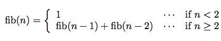

------------------------------------------------------------------------

[]()

オブジェクト指向プログラミング実習 課題4
========================================

### この課題をクリアするには

1.  チーム全員がこのページの内容を理解していること．
2.  チームを代表して誰かメンバーがプロジェクト課題を提出すること．
3.  (出席している)チーム全員がmanabaの「課題４確認ドリル」を何回か受験すること．
4.  最後に，(出席している)チーム全員で教員のところに来て質疑セッションを行うこと．

また，早く課題をクリアするには，さらに
オプション問題を解く必要があります．

トピック：Scannerを用いた入力
-----------------------------

[java.util.Scanner](http://docs.oracle.com/javase/jp/7/api/java/util/Scanner.html)クラスは，標準入力(通常はキーボード)やファイルから，
整数や単語や行といった単位を読み込むのに便利なクラスである． たとえば，
[nextLine()](http://docs.oracle.com/javase/jp/7/api/java/util/Scanner.html#nextLine())
は行を，
[nextInt()](http://docs.oracle.com/javase/jp/7/api/java/util/Scanner.html#nextInt())
は整数を一つ読み込む．

#### 例題:

``` {.program}
import java.util.Scanner;

class EchoLine {
  public static void main(String[] args) {
    Scanner scanner = new Scanner(System.in);
    String s = scanner.nextLine();
    System.out.println("入力された文字列は:" + s);
  }
} 
```

上の例題は、キーボードから文字列を1行入力して、String型の変数sに代入している．

#### 例題:

``` {.program}
import java.util.Scanner;

class EchoInt {
  public static void main(String[] args) {
    Scanner scanner = new Scanner(System.in);
    int i = scanner.nextInt();
    System.out.println("入力された整数は:" + i);
  }
} 
```

上の例題は、キーボードから整数を1つ入力して，int型の変数iに代入している．

[BufferedReader](http://docs.oracle.com/javase/jp/7/api/java/io/BufferedReader.html)の[readLine()](http://docs.oracle.com/javase/jp/7/api/java/io/BufferedReader.html#readLine%28%29)メソッドを使って行を読み取り，
[Integer.parseInt()メソッド](http://docs.oracle.com/javase/jp/7/api/java/lang/Integer.html#parseInt%28java.lang.String%29)を用いて整数に変換するのと比べて，
かなり簡便である．

また，キーボードやテキストファイルから単語(トークン)をひとつ読み込むには，
[next()](http://docs.oracle.com/javase/jp/7/api/java/util/Scanner.html#next())
メソッドが利用できる．「トークン」の区切りは，
[useDelimiterメソッド](http://docs.oracle.com/javase/jp/7/api/java/util/Scanner.html#useDelimiter(java.lang.String))で変更することができる．
デフォルトは空白や改行などのホワイトスペース文字が区切りとなっている．
[]()

トピック：コレクション
----------------------

一般に，
「集合」「列」「写像」といった抽象的なデータ（やりたいこと・**仕様**）と
「線形リスト」「配列」「ハッシュ表」「木構造」といった具体的なデータ構造
（どうやって実現するか・**実装**）を切り離しておいた方が，
変更に強く，再利用しやすいプログラムを作ることができる．

Javaでは，抽象的なデータを表すためにインターフェースを用いることが多い．
抽象的なデータの実装(implementation)は，
インターフェースをimplementしたクラスによって表す．

Javaでは，「集合」「列」「写像」などの
データの集まり（コレクション）を表すインターフェースとして
以下のようなものが用意されている．

[`java.util.Set`](http://docs.oracle.com/javase/jp/7/api/java/util/Set.html)[]()

集合(重複のないコレクション)を表すインターフェースで，実装するクラスとしては

-   [`java.util.HashSet`](http://docs.oracle.com/javase/jp/7/api/java/util/HashSet.html)[(ハッシュ表を使ったSetの実装)]()
-   [`java.util.TreeSet`](http://docs.oracle.com/javase/jp/7/api/java/util/TreeSet.html)[(木構造を使ったSetの実装)]()
-   [`java.util.LinkedHashSet`](http://docs.oracle.com/javase/jp/7/api/java/util/LinkedHashSet.html)(ハッシュ表と線形リストを用いたSetの実装)

が用意されている．

[`java.util.List`](http://docs.oracle.com/javase/jp/7/api/java/util/List.html)[]()

列(ある順序で並んだ，重複を許すコレクション)を表すインターフェースで，実装として

-   [`java.util.ArrayList`](http://docs.oracle.com/javase/jp/7/api/java/util/ArrayList.html)(配列を使ったListの実装)
-   [`java.util.LinkedList`](http://docs.oracle.com/javase/jp/7/api/java/util/LinkedList.html)(線形リストを使ったListの実装)

などが用意されている．

[`java.util.Map`](http://docs.oracle.com/javase/jp/7/api/java/util/Map.html)[]()

写像（キーから値への対応づけの集合）を表すインターフェースで，実装としては

-   [`java.util.HashMap`](http://docs.oracle.com/javase/jp/7/api/java/util/HashMap.html)(ハッシュ表を使ったMapの実装)
-   [`java.util.TreeMap`](http://docs.oracle.com/javase/jp/7/api/java/util/TreeMap.html)(木構造を使ったMapの実装)

などがある．

また，ListとSetの親インターフェース(スーパーインターフェース) として
[`java.util.Collection`](http://docs.oracle.com/javase/jp/7/api/java/util/Collection.html)
がある．

------------------------------------------------------------------------

具体的な使い方を説明する．

例えば「文字列の集合」を表す抽象的なデータ型を持つ変数は，

``` {.program}
  Set<String> setOfString;
```

のように宣言する．この変数には，たとえば，

``` {.program}
  setOfString = new HashSet<String>();
```

のように，あるいは，

``` {.program}
  setOfString = new TreeSet<String>();
```

のように，集合を表す具体的なデータ
(Setインターフェースを実装している任意のクラスのインスタンス)を代入できる．

集合に要素を付け加えるには，

``` {.program}

  setOfString.add("hello!");
```

のように
[addメソッド](http://docs.oracle.com/javase/jp/7/api/java/util/Set.html#add(E))
を用いる．

;; 追記　elect         ;;;;;;;;;;;;;;;;;;;;;;;;;;;;;;;;;;;;;;;;;;;;;;;;;;;;;;;;;;;;;;;        
void add(int index, E element) : index番目に要素を入れる、最後に入れるなら add(0, element)        
boolean add(E e) : 先頭にelement を入れる        
;;;;;;;;;;;;;;;;;;;;;;;;;;;;;;;;;;;;;;;;;;;;;;;;;;;;;;;;;;;;;;;;;;;;;;;;;;        

集合に文字列が含まれているかどうかは，
[containsメソッド](http://docs.oracle.com/javase/jp/7/api/java/util/Set.html#contains(java.lang.Object))を使って調べることができる．

``` {.program}
  if (setOfString.contains("word")) {
    System.out.println("The set contains 'word'");
  }
```

また，集合にいくつ要素が含まれているかは，
[sizeメソッド](http://docs.oracle.com/javase/jp/7/api/java/util/Set.html#size())を使って調べることができる．

``` {.program}
  System.out.println("The set contains " +  setOfString.size() " strings.");
```

これらの操作は，具体的なデータ型(実装)がHashSet, TreeSet,
LinkedHashSetのどれであっても，同じように行なうことができる．
具体的なデータ型によって性能の特性(追加や参照の速度や，
内部でソートされているかどうかなど)が異なるので，
プログラムをなるべく変更せずに，用途に応じた実装を使い分けることができる．

------------------------------------------------------------------------

また，SetはListなどと並んでCollectionの一種(サブインターフェース)
であるので，集合データはCollection型の変数に代入することができる．

``` {.program}
  Collection<String> col = setOfString;
```

上で説明したadd, contains, sizeの操作は，
集合に限らず，どんなCollectionに対してでも行なうことができる．

------------------------------------------------------------------------

#### 例題: 文字列のリスト

``

``` {.program}
import java.util.*;

class ListTest {
  public static void main(String[] args) {
    List<String> list = new LinkedList<String>();
    for (int i = 0;i < args.length; i++) {
      list.add(args[i]);
    }
    System.out.println(list.size() + " words.");
  }
}
```

Javaのmainメソッドの引数の文字列配列(上の例ではargs)は，
Javaプログラムをシェルから起動した時にコマンドラインから与えた引数が入る．

上のプログラムは，コマンドラインから与えた引数の数を
数えるプログラムである．[Listインターフェース](http://docs.oracle.com/javase/jp/7/api/java/util/List.html)を用いて
複数の文字列を集め，最後にリストの中の要素の数を出力している．
Listの実装としては，[LinkedList](http://docs.oracle.com/javase/jp/7/api/java/util/LinkedList.html)
(線形リスト)を用いている．

#### 実行例:

(**太字**が入力) ``

``` {.interaction}
$ java ListTest apple orange
2 words.
$ java ListTest apple orange banana orange apple
5 words.
$
```

------------------------------------------------------------------------

#### 例題: 文字列の集合

下のクラスSetTestは， 上のListTestを元にして，
Listインターフェースの代わりに[Set](http://docs.oracle.com/javase/jp/7/api/java/util/Set.html)を，
LinkedListの代わりに[HashSet](http://docs.oracle.com/javase/jp/7/api/java/util/HashSet.html)を使い，
重複を取り除いた文字列の数を数えるようにした ものである． ``

``` {.program}
import java.util.*;

class SetTest {
  public static void main(String[] args) {
    Set<String> set = new HashSet<String>() ;
    for (int i = 0;i < args.length; i++) {
      set.add(args[i]);
    }
    System.out.println(set.size() + " words.");
  }
}
```

#### 実行例:

(**太字**が入力) ``

``` {.interaction}
$ java SetTest apple orange
2 words.
$ java SetTest apple orange banana orange apple
3 words.
$
```

------------------------------------------------------------------------

#### 例題: 単語数え

``

``` {.program}
import java.util.*;

class WordCount {
    public static void main(String[] args) {
      Scanner input = new Scanner(System.in);
      int count = 0;
      while (input.hasNext()) {
          input.next();  // トークン(単語)をひとつ読む．読んだ結果は使わない．
          count++;
      }
      System.out.println (count + " words.");
  }
}
```

上のプログラムは，標準入力から入力が尽きるまで読み込み，その中にトークン
がいくつあるか数える．

ここでは，Scannerのnext()を呼ぶたびにトークンを１つずつ返す機能を用いている．
文字列中にもうトークンが残っていないなら，hasNext()がfalseを返す．

#### 実行例:

(**太字**が入力) ``

``` {.interaction}
$ java WordCount
A B C
D E A B
^D (コントロールD)
7 words.
$ java WordCount < ~maeda/const
297 words.
```

------------------------------------------------------------------------

### 設問1: 語彙数え

上のWordCountを参考に， 重複を取り除いた単語の数を数えるようにした
クラスWordSetCountを作りなさい．

#### 実行例:

(**太字**が入力) ``

``` {.interaction}
$ java WordSetCount
A B C
D E A B
^D (コントロールD)
5 words.
$ java WordSetCount < ~maeda/const
156 words.
$
```

**WordSetCount.javaを提出しなさい．**

------------------------------------------------------------------------

#### 例題: ファイルからの読み込み

``

``` {.interaction}
import java.io.*;
import java.util.*;

class FileWordCount {
    // 指定した名前のファイルから読むScannerを作って返すクラスメソッド
    static Scanner fileScanner(String fileName) {
        Scanner value = null;
        try {
            value = new Scanner(new File(fileName));
        } catch (FileNotFoundException e) {
            System.err.println("ファイル" +  fileName + "は存在しません。");
            System.exit(1);
        }
        return value;
    }
    public static void main(String[] args) {
        Scanner input = fileScanner(args[0]);
        int count = 0;
        while (input.hasNext()) {
            input.next();  // トークン(単語)をひとつ読む．読んだ結果は使わない．
            count++;
        }
        System.out.println (count + " words.");
    }
}
```

上のプログラムは，WordCountを変更して，
標準入力の代わりにファイルから読み込むようにしたものである．
Fileは，コンストラクタに与えた文字列が示すファイルを 表すクラスである．
存在しないファイルに対してScannerを作ろうとすると
エラーメッセージを表示して終了する．

#### 実行例:

(**太字**が入力) ``

``` {.interaction}
$  java FileWordCount SetTest.java 
34 words.
$ java FileWordCount ~maeda/const
297 words.
$ java FileWordCount ~maeda/dict
45389 words.
$
```

FileWordCount.fileScannerメソッドは，これ以降の設問で呼び出してもよいこととする．

------------------------------------------------------------------------

### 設問2: 簡易スペルチェック

ファイル名を1つコマンドライン引数として受け取り， そのファイル内にあって
/home/prof/maeda/dict ファイル内にない単語を
ミススペルとみなして出力するクラスSpellを作りなさい．

-   スキャナに対して useDelimiter("\[\^a-zA-Z\]+")を実行し，
    単語の区切りを「英字以外の文字の並び」とすること(つまり，単語の定義は「英字の並び」となる)．
-   単語どうしは，StringクラスのStringクラスの[toLowerCase](http://docs.oracle.com/javase/jp/7/api/java/lang/String.html#toLowerCase())メソッドを用いて
    すべて小文字に変換して比較すること．
-   同じ単語を2回以上出力しないようにすること．

#### ヒント：

まず集合dictに，ファイル/home/prof/maeda/dict内の単語をすべて(小文字に変換して)加えておく．

------------------------------------------------------------------------

#### 実行例:

(**太字**が入力) ``

``` {.interaction}
$ java Spell ~maeda/const
a
rescripts
$ java Spell SetTest.java 
util
settest
args
hashset
int
i
println
$ 
```

**Spell.javaを提出しなさい．**

------------------------------------------------------------------------

[Top](#top)

トピック：ラッパークラス
------------------------

Javaのint型やchar型などの基本型(primitive
type)の値はオブジェクトではない ので，
[List](http://docs.oracle.com/javase/jp/7/api/java/util/List.html)[や]()[Set](http://docs.oracle.com/javase/jp/7/api/java/util/Set.html)[にそのまま格納することはできない．
基本型それぞれについて]()[Integer](http://docs.oracle.com/javase/jp/7/api/java/lang/Integer.html),
[Character](http://docs.oracle.com/javase/jp/7/api/java/lang/Character.html)など対応するクラスが用意されていて，
これらに変換して格納しなければならない．
IntegerやCharacterなどは，単に基本型の値を包み込んで
オブジェクトにするためだけのクラスなのでラッパー(wrapper)クラスと呼ばれている．

基本型とラッパークラスの変換は，ほぼ自動的に行なわれるので，
あまりプログラマが意識する必要はないが， **整数の集合は`Set<int>`
ではなく`Set<Integer>`
のように，ラッパークラスの名前を書く必要がある．**

  基本型    ラッパークラス名
  --------- ------------------
  boolean   Boolean
  byte      Byte
  short     Short
  int       Integer
  long      Long
  float     Float
  double    Double
  char      Character

  : ラッパークラス一覧

#### 例題4: 整数の集合

``

``` {.program}
import java.util.*;

class Primes {
  public static void main(String[] args) {
    // 素数でないことがわかっている整数の集合
    Set<Integer> nonprime = new HashSet<Integer>(); 

    for (int i = 2; i < 100; i++) {
      if (! nonprime.contains(i)) {
        // 新しい素数が見つかった
        System.out.println(i);
        // iの倍数を集合に入れる
        for (int j = i + i; j < 100; j += i) {
          nonprime.add(j);
        }
      }
    }
  }
}
```

上のプログラムは，100未満の素数を画面に出力する．

#### 実行例:

(**太字**が入力) ``

``` {.interaction}
$ java Primes
2
3
...
97
$
```

------------------------------------------------------------------------

トピック: Iteratorと拡張for文
-----------------------------

コレクションの内容を順にすべて取り出したい時，
すなわちコレクションの中身について繰返し(iteration)を行ないたい時のために，
[Iterator](http://docs.oracle.com/javase/jp/7/api/java/util/Iterator.html)というインターフェースが用意されている．

Iteratorを用いて繰返しを行なうには，
オブジェクトがまだ残っているかどうかを調べるメソッド
[hasNext()](http://docs.oracle.com/javase/jp/7/api/java/util/Iterator.html#hasNext())と
次のオブジェクトを返すメソッド
[next()](http://docs.oracle.com/javase/jp/7/api/java/util/Iterator.html#next())を用いて以下のようにする．
``

``` {.program}
  Iterator i = ...;
  while (i.hasNext()) {
    E x = i.next();
    ...
  }
```

これは[Scanner](https://moodle.tsukuba.ac.jp/mod/resource/view.php?id=24956#scanner)の使い方と同じであるが，
実際ScannerもIteratorの一種(Iteratorインターフェースを実装したクラス)
になっている．

SetやListからIteratorを取り出すには，
[iterator()](http://docs.oracle.com/javase/jp/7/api/java/util/Set.html#iterator())メソッドを用いる．
たとえば，Set&lt;String&gt;の全要素について繰り返しを行なうには， ``

``` {.program}
  Set<String> set = ...;
  Iterator<String> i = set.iterator();
  while (i.hasNext()) {
    String s = i.next();
    ...
  }
```

のようにすればよい．

### コレクションに対する，より簡便な繰り返し

しかし実は，SetやListのように，iterator()メソッドでIteratorを取り出せるもの
([Iterableインターフェース](http://docs.oracle.com/javase/jp/7/api/java/lang/Iterable.html)を実装しているもの)
については，より簡単な構文を使うことができて，上と同じ繰り返しを， ``

``` {.program}
  Set<String> set = ...;
  for (String s: set) {
    ...
  }
```

と書くことができる． ``

``` {.program}
import java.util.*;

class Primes2 {
    public static void main(String[] args) {
        Set<Integer> primes = new HashSet<Integer>(); // 素数の集合
        outer: for (int i = 2; i < 100; i++) {
            for (int p : primes) {
                if (i % p == 0) {
                    // 割り切れた．iは素数でない．
                    continue outer;
                }
            }
            // 新しい素数が見つかった
            System.out.println(i);
            // iを集合に入れる
            primes.add(i);
        }
    }
}
```

#### 実行例:

(**太字**が入力) ``

``` {.interaction}
$ java Primes2
2
3
...
97
$
```

------------------------------------------------------------------------

トピック：Map
-------------

「写像」あるいは「対応づけ」を表すコレクションである
[`java.util.Map`](http://docs.oracle.com/javase/jp/7/api/java/util/Map.html)[の使い方を練習しよう．]()

たとえば，「文字列から整数へのMap」は ``

``` {.program}
  Map<String, Integer> map;
```

のように宣言する．具体的なデータ，たとえばHashMapクラスのインスタンスを
つくって代入するには， ``

``` {.program}
  map = new HashMap<String, Integer>();
```

のようにする．

Mapに[putメソッド](http://docs.oracle.com/javase/jp/7/api/java/util/Map.html#put(K,%20V))でキーと値の対応を書き込んでおき，
後で[getメソッド](http://docs.oracle.com/javase/jp/7/api/java/util/Map.html#get(java.lang.Object))でキーに対応する値を取り出すことができる．
また，[containsKeyメソッド](http://docs.oracle.com/javase/jp/7/api/java/util/Map.html#containsKey(java.lang.Object))で，キーが含まれているかどうか調べることができる．
[keySetメソッド](http://docs.oracle.com/javase/jp/7/api/java/util/Map.html#keySet())は，キーの集合を取り出す．

#### 例題: キーワードと数値の対応

下のプログラムは，--from で与えた整数から --to で与えた整数まで， --step
で与えた間隔で増やしながら出力する． --from, --to,
--stepはどの順序で与えても良く，また省略しても良い． --from, --to,
--stepを省略したときの値はそれぞれ1, 10, 1である． ``

``` {.program}
import java.util.*;

class FromTo {
    private static void setToMap(Map<String,Integer> map, String[] args) {
        for (int i = 0;i < args.length; i += 2) {
            map.put(args[i], Integer.parseInt(args[i + 1]));
        }
    }
    public static void main(String[] args) {
        Map<String, Integer> map = new HashMap<String, Integer>();
        String[] defaultValues = {"--from", "1", "--to", "10", "--step", "1"};
        // 初期値を与えておく
        setToMap(map, defaultValues);

        // コマンドライン引数でmapを更新
        setToMap(map, args);

        // 値を取り出す
        int from = map.get("--from");
        int to = map.get("--to");
        int step = map.get("--step");
        for (int i = from; i <= to; i += step) {
           System.out.println(i);
        }
    }
}
```

#### 実行例:

(**太字**が入力) ``

``` {.interaction}
$ java FromTo
1
2
3
4
5
6
7
8
9
10
$ java FromTo --from 3 --step 2
3
5
7
9
$ java FromTo --step 3 --to 7
1
4
7
$
```

### 設問3: Fibonacci数のメモ化

Fibonacci数は，負でない整数nに対して，\
\
と帰納的(再帰的)に定義される数列である．以下は，
Fibonacci数を上の定義どおりに(ただし，モジュロ演算を使って下5桁のみを)
計算し，結果と計算時間を表示する プログラムである． ``

``` {.program}
public class Fib {
    static int fib(int n) {
        if (n < 2) {
            return 1;
        } else {
            return (fib(n - 1) + fib(n - 2)) % 100000;
        }
    }
    public static void main(String[] args) {
        long start = System.nanoTime();
        int n = Integer.parseInt(args[0]);
        System.out.println("fib(" + n + ") = " + fib(n));
        System.out.println((System.nanoTime() - start) / 1000000 + "ms");
    }
}
```

#### 実行例:

(**太字**が入力) ``

``` {.interaction}
$ time java Fib 10
fib(10) = 89
0ms
$ time java Fib 44
fib(44) = 3170
2636ms
$
```

上のプログラムは，同じ引数に対する値(例えばfib(3))を何度も計算するので効率が悪い．
実行時間を測ると，
引数が大きくなるにつれて指数関数的に時間がかかってしまう．
これを改善するために，一度計算した(2以上の)引数に対する値をMapに覚えておき，
もし引数がMapにすでにあれば計算せずにその値を返すようにしなさい．

このような考え方で
効率を改善したクラスFib2(やはり，下5桁のみ計算するもの)を作りなさい．

### 実行例:

(**太字**が入力) ``

``` {.interaction}
$ time java Fib2 10
fib(10) = 89
0ms
$ time java Fib2 44
fib(44) = 3170
0ms
$ time java Fib2 4400
fib(4400) = 41026
5ms
```

**Fib2.javaを提出しなさい．**

参考: このように，結果を記憶しておいて効率を改善するテクニックを
メモ化(memoization)と呼ぶ．

------------------------------------------------------------------------

### 早くクリアするためのオプション問題: 対数オーダーのFibonacci数

1/19(木)までにこの課題をクリアするには，この問題を解くこと．

n番目のFibonacci数の下5桁を、 整数のみを用いて、時間計算量がO(log
n)のオーダーで
計算するクラスFibLogを作りなさい。FIbLog.javaを提出しなさい。

ヒント: 行列のn乗演算はO(log n)で計算できる．

------------------------------------------------------------------------

### 設問4: 単語の頻度数え

ファイルに含まれる単語の出現頻度を調べる クラスFreqを作りなさい．

-   単語は，「英文字の並び」とする(つまり，「英文字以外」で区切られた文字列とする)．
-   すべて小文字に変換して処理すること．

#### 実行例:

(**太字**が入力) ``

``` {.interaction}
$ java Freq ~maeda/const
2:a
1:accomplish
1:acting
1:action
1:again
7:all
1:alone
2:an
18:and
...(略)...
2:time
6:to
1:trust
1:trusting
1:tyranny
2:universal
2:upon
1:visited
1:want
1:war
10:we
4:which
1:who
5:with
2:world
1:would
$
```

**Freq.javaを提出しなさい．**

ヒント： TreeMapを使って，単語ごとの出現頻度を記録する．
(TreeMapを使うと，キー集合は自動的に昇順にソートされる．)

------------------------------------------------------------------------

[Top](#top)

### 早くクリアするためのオプション問題: 循環小数

1/25(水)までに課題をクリアするには，この問題も解くこと．

2つの数m,
nを入力すると，m/nの値を出力するプログラム(クラス名はFraction)を作りなさい．

-   m/nが整数になる場合は，単にその整数を出力する．
-   m/nが有限桁の小数で表わされる場合には，その小数のすべての桁を正確に出力する．
-   m/nが循環小数で表わされる場合には，循環し終える部分までを出力し，次の行で循環する範囲を\^で示す．

たとえ「整数部も含めて循環している」とみなせる場合であっても，循環を示す印は，小数点以下の範囲のみにつけることにする(以下の100/7の例参照)．

Fraction.javaを提出しなさい．

ヒント:
筆算の手順で割り算を進めていき，同じ余りの値がまた出てきたら循環したことがわかる．

#### 実行例:

(**太字**が入力) ``

``` {.interaction}
$ java Fraction 100 4
100/4 = 25
$ java Fraction 10 4
10/4 = 2.5
$ java Fraction 100 3
100/3 = 33.3
           ^
$ java Fraction 100 7
100/7 = 14.285714
           ^^^^^^
$ java Fraction 1 7
1/7 = 0.142857
        ^^^^^^
$ java Fraction 1 170
1/170 = 0.00588235294117647
           ^^^^^^^^^^^^^^^^
$ java Fraction 1 379721
(略)
```

------------------------------------------------------------------------

[Top](#top)

------------------------------------------------------------------------
