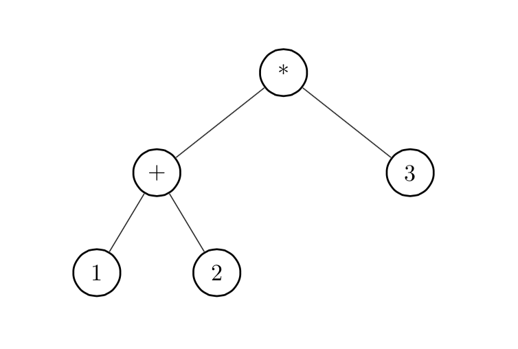

------------------------------------------------------------------------

[]()

オブジェクト指向プログラミング実習 課題5
========================================

### この課題をクリアするには

1.  チーム全員がこのページの内容を理解していること．
2.  チームを代表して誰かメンバーがプロジェクト課題を提出すること．
3.  (出席している)チーム全員がmanabaの「課題５確認ドリル」を何回か受験すること．
4.  最後に，(出席している)チーム全員で教員のところに来て質疑セッションを行うこと．

また，早く課題をクリアするには，さらに
オプション問題を解く必要があります．

トピック：スタック操作，対話型プログラム
----------------------------------------

#### 例題: スタック式電卓

次のプログラムは，簡単な電卓プログラムである．

``` {.program}
import java.util.*;

public class Calc {
    public static void main(String[] args) {
        Deque<Integer> stack = new LinkedList<Integer>();
        Scanner scanner = new Scanner(System.in);
        while (scanner.hasNext()) {
            if (scanner.hasNextInt()) {
                int v = scanner.nextInt();
                stack.push(v);
            } else {
                String token = scanner.next();
                if (token.equals("+")) {
                    int v2 = stack.pop();
                    int v1 = stack.pop();
                    stack.push(v1 + v2);
                } else if (token.equals("-")) {
                    int v2 = stack.pop();
                    int v1 = stack.pop();
                    stack.push(v1 - v2);
                } else if (token.equals("*")) {
                    int v2 = stack.pop();
                    int v1 = stack.pop();
                    stack.push(v1 * v2);
                } else if (token.equals("/")) {
                    int v2 = stack.pop();
                    int v1 = stack.pop();
                    stack.push(v1 / v2);
                } else if (token.equals("=")) {
                    for (int p : stack) {
                        System.out.println(p);
                    }
                } else {
                    System.out.println("エラー: 誤ったトークン: " + token);
                }
            }
        }
    }
}
```

整数を入力すると，スタックにプッシュする． 「=」
を入力すると，いまスタックに積まれている値を，最後にプッシュした値から順に出力する．
「+」, 「-」, 「\*」,
「/」を入力すると，スタックトップの２つの値をポップし，演算を行って，結果をスタックにプッシュする．
入力が尽きると(Macの場合，行頭でControl-Dを入力すると)終了する．

上では，[Scanner](collection.html#scanner)オブジェクトの
[hasNextInt()](http://docs.oracle.com/javase/jp/7/api/java/util/Scanner.html#hasNextInt())
メソッドを用いて，次に読み込むトークンが整数かどうかを判別している．
また，
[Deque](http://docs.oracle.com/javase/jp/7/api/java/util/Deque.html)
インターフェースは，スタックとキューの両方の操作を定義したインターフェー
スで，これを実装したクラスとして[LinkedList](http://docs.oracle.com/javase/jp/7/api/java/util/LinkedList.html)がある．

#### 実行例:

(下線が入力, 緑字は注釈．) ``

``` {.interaction}
$ java Calc
3 5 7 1     ← 4つの数をプッシュ
=           ← スタックの内容を表示
1
7
5
3
^D            ← 行の先頭でControl-Dを入力
$
$ java Calc
3 1 - =    ← 3から1を引いたものを表示
2
5 * =      ← その結果に5をかけて表示
10
2 / =      ← 2で割って表示
5
```

------------------------------------------------------------------------

#### 例題： オブジェクト指向風味に書き換えたスタック電卓

上記のプログラムを書き換えて，拡張を容易にするために，演算をオブジェクトで表現し
たのが下記のプログラムである．

``` {.program}
import java.util.*;

public class OOCalc {
    // OOCalcのインナークラス
    abstract class Op {
        abstract public String opName();
        abstract public void exec(Deque<Integer> stack);
    }
    class PrintOp extends Op {
        public String opName() { return "="; }
        public void exec(Deque<Integer> stack) {
            for (int p : stack) {
                System.out.println(p);
            }
        }
    }
    abstract class BinOp extends Op {
        abstract public int op(int rand1, int rand2);
        public void exec(Deque<Integer> stack) {
            int v2 = stack.pop();
            int v1 = stack.pop();
            stack.push(op(v1, v2));
        }
    }
    class AddOp extends BinOp {
        public String opName() { return "+"; }
        public int op(int rand1, int rand2) { return rand1 + rand2; }
    }
    class SubOp extends BinOp {
        public String opName() { return "-"; }
        public int op(int rand1, int rand2) { return rand1 - rand2; }
    }
    class MulOp extends BinOp {
        public String opName() { return "*"; }
        public int op(int rand1, int rand2) { return rand1 * rand2; }
    }
    class DivOp extends BinOp {
        public String opName() { return "/"; }
        public int op(int rand1, int rand2) { return rand1 / rand2; }
    }
    class NoOp extends Op {
        public String opName() { return "noop"; }
        public void exec(Deque<Integer> stack) {
            // 何もしない
        }
    }
    // 命令一覧表
    Op[] optable = {new AddOp(), new SubOp(), new MulOp(), new DivOp(), 
                    new NoOp(), new PrintOp()};
    Deque<Integer> stack;
    Scanner scanner;
    Map<String, Op> ops;  // 単語辞書
    OOCalc() {
        stack = new LinkedList<Integer>();
        scanner = new Scanner(System.in);
        ops = new HashMap<String, Op>();
        // 辞書に命令語を登録する．
        for (Op op : optable) {
            ops.put(op.opName(), op);
        }
    }
    public void run() {
        while (scanner.hasNext()) {
            if (scanner.hasNextInt()) {
                stack.push(scanner.nextInt());
            } else {
                String token = scanner.next();
                if (ops.containsKey(token)) {
                    try {
                        ops.get(token).exec(stack); // 辞書を引いて命令を解釈する．
                    } catch (Exception e) {
                        System.out.println("エラー: " + e);  // 実行時エラー
                    }
                } else {
                    System.out.println("エラー: 誤ったトークン: " + token);
                }
            }
        }
    }
    public static void main(String[] args) {
        new OOCalc().run();
    }
}
```

このプログラムでは，「+」や「-」などの演算子の名前や，演算処理をメインループの中に
直接書くのを避けて，ops という辞書(Map)に演算子の名前と，
その演算子を処理するオブジェクトを登録している．
Calcにあった，演算子を識別するための長いif文がなくなって，オーバーライドされた
opメソッドの呼び出しに置き換えられていることに注目してほしい．

クラスOOCalcの中で定義しているOp, PrintOp, ...などのクラスは
**インナークラス**と言い，OOCalcの外から参照するには それぞれOOCalc.Op,
OOCalc.PrintOp, ... といったクラス名を使う．
関連するクラスをまとめてかける他，
OOCalcの外で定義したクラスと名前がぶつかるおそれがないという利点がある．

新しい演算子命令を追加するには，Opを継承した新しいクラスを作り，
そのインスタンスをoptableに登録しておけばよい．コンストラクタでは，optable内の
すべてのオブジェクトを，辞書opsに登録している．

#### 実行例:

(下線が入力, 緑字は注釈．) ``

``` {.interaction}
$ java OOCalc
3 1 - =
2
6 * =
12
3 / =
4
2 / =
2
+
エラー: java.util.NoSuchElementException ← スタック内の数値の数が足りないのでエラー
1 0 / 
エラー: java.lang.ArithmeticException: / by　zero  ← ゼロ除算
^D            ← 行の先頭でControl-Dを入力
$  
```

------------------------------------------------------------------------

### 設問1: 日本語風電卓

OOCalcを元に，以下の拡張を加えた電卓JCalcを作りなさい．

-   OOCalcの命令が同じように使えること．
-   「+」, 「-」, 「\*」, 「/」
    について，それぞれ「足す」「引く」「かける」「割る」
    という別名(実際に処理するオブジェクトは同じ)が使えるようにすること．
    また，何も処理をしない命令「noop」(クラス名はNoOp)を作り，その別名として
    「から」「と」「を」「で」という単語を割り当てて，
    これらの単語を無視するようにすること．

    別名の登録のために，以下の表を利用するとよい． ``{.program}

            String[][] alias = {{"足す", "+"}, {"引く", "-"}, {"かける", "*"}, {"割る", "/"},
                                {"から", "noop"}, {"と", "noop"}, {"を", "noop"}, {"で", "noop"}};

#### プログラムのおおまかな形

``

``` {.program}
import java.util.*;

public class JCalc extends OOCalc {
    String[][] alias = {{"足す", "+"}, {"引く", "-"}, {"かける", "*"}, {"割る", "/"},
                        {"から", "noop"}, {"と", "noop"}, {"を", "noop"}, {"で", "noop"}};
    JCalc() {
       for (String[] pair : alias) {
          ops.put(..., ...);
       }
    }
    public static void main(String[] args) {
        new JCalc().run();
    }
}
```

上記の「...」の部分を埋めてJCalcを完成させなさい．他の部分を変えてはいけない．

#### 実行例:

(下線が入力, 緑字は注釈．) ``

``` {.interaction}
$ java JCalc
3 から 1 を 引く = ← 「3 1 - =」と同じ．「から」「を」は無視する．
2
6 を かける =
12
3 で 割る =
4
```

**JCalc.javaを提出しなさい．**

------------------------------------------------------------------------

トピック： Generics
-------------------

コレクションで出てきた `List<String> ` (文字列のリスト)や
`Map<Integer, Integer>` (整数から整数へのマップ)
のように，他の型をパラメータとして含むJavaの型を**ジェネリックな型**という．
(これに関連するJavaの機能を総称してGenericsと呼んでいる．)

たとえば，任意の型`E`のオブジェクトのペアを表すクラスは，以下のように書ける．
``

``` {.program}
public class Pair<E> {
    E a, b;
    Pair(E a, E b) {
        this.a = a;
        this.b = b;
    }
    public E getFirst() { return a; }
    public E getSecond() { return b; }

    public static void main(String[] args) {
        // テストプログラム

        Pair<Integer> i = new Pair<Integer>(1, 2);
        System.out.println(i.getFirst());

        Pair<String> s = new Pair<String>("foo", "bar");
        System.out.println(s.getSecond());
    }
}
```

#### 実行例:

(下線が入力, 緑字は注釈．) ``

``` {.interaction}
$ java Pair
1
bar
$ 
```

また，
[Number](http://docs.oracle.com/javase/jp/7/api/java/lang/Number.html)
のサブクラスだけを型パラメータとして受け取れるPointクラスは，以下のように定義できる．
``

``` {.program}
public class Point<E extends Number> {  // Eは型変数．Numberのサブクラスに限定
    private E x, y;
    Point(E x, E y) {
        this.x = x;
        this.y = y;
    }
    public E getX() { return x; }
    public E getY() { return y; }
    public String toString() { return "(" + x.toString() + ", " + y.toString() + ")"; }

    public static void main(String[] args) {
        // テストプログラム

        Point<Integer> p1 = new Point<Integer>(1, 2);
        System.out.println(p1);

        Point<Double> p2 = new Point<Double>(3.5, 4.1);
        System.out.println(p2);

        // Point<String> p3 = new Point<String>("foo", "bar"); // エラー
    }
}
```

#### 実行例:

(下線が入力, 緑字は注釈．) ``

``` {.interaction}
$ java Point
(1, 2)
(3.5, 4.1)
$ 
```

------------------------------------------------------------------------

#### 例題： Genericsを使った電卓

Genericsを用いてOOCalcを書き換えると以下のようになる． ``

``` {.program}
// ファイル Numeric.java

public interface Numeric<E extends Numeric> {
    public E add(E num);
    public E subtract(E num);
    public E multiply(E num);
    public E divide(E num);
    public String toString();
}

// ファイル OOGCalc.java

import java.util.*;

public abstract class OOGCalc<E extends Numeric<E>> {
    // OOGCalcのインナークラス
    abstract class Op {
        abstract public String opName();
        abstract public void exec(Deque<E> stack);
    }
    class PrintOp extends Op {
        public String opName() { return "="; }
        public void exec(Deque<E> stack) {
            for (E p : stack) {
                System.out.println(p);
            }
        }
    }
    abstract class BinOp extends Op {
        abstract public E op(E rand1, E rand2);
        public void exec(Deque<E> stack) {
            E v2 = stack.pop();
            E v1 = stack.pop();
            stack.push(op(v1, v2));
        }
    }
    class AddOp extends BinOp {
        public String opName() { return "+"; }
        public E op(E rand1, E rand2) { return rand1.add(rand2); }
    }
    final AddOp ADD_OP = new AddOp();
    class SubOp extends BinOp {
        public String opName() { return "-"; }
        public E op(E rand1, E rand2) { return rand1.subtract(rand2); }
    }
    final SubOp SUB_OP = new SubOp();
    class MulOp extends BinOp {
        public String opName() { return "*"; }
        public E op(E rand1, E rand2) { return rand1.multiply(rand2); }
    }
    final MulOp MUL_OP = new MulOp();
    class DivOp extends BinOp {
        public String opName() { return "/"; }
        public E op(E rand1, E rand2) { return rand1.divide(rand2); }
    }
    final DivOp DIV_OP = new DivOp();
    // 命令一覧表
    Deque<E> stack;
    Scanner scanner;
    Map<String, Op> ops;  // 単語辞書
    OOGCalc() {
        stack = new LinkedList<E>();
        scanner = new Scanner(System.in);
        ops = new HashMap<String, Op>();
        // 辞書に命令語を登録する．
        ops.put("+", ADD_OP);
        ops.put("-", SUB_OP);
        ops.put("*", MUL_OP);
        ops.put("/", DIV_OP);
        ops.put("=", new PrintOp());
    }
    protected abstract E fromInt(int v);
    public void run() {
        while (scanner.hasNext()) {
            if (scanner.hasNextInt()) {
                stack.push(fromInt(scanner.nextInt()));
            } else {
                String token = scanner.next();
                if (ops.containsKey(token)) {
                    try {
                        ops.get(token).exec(stack); // 辞書を引いて命令を解釈する．
                    } catch (Exception e) {
                        System.out.println("エラー: " + e);
                    }
                } else {
                    System.out.println("エラー: 誤ったトークン: " + token);
                }
            }
        }
    }
}

// ファイル IntCalc.java

public class IntCalc extends OOGCalc<IntCalc.Int> {
    // IntCalcのインナークラス IntCalc.Int
    class Int implements Numeric<Int> {
        int value;
        Int(int value) { this.value = value; }
        public Int add(Int v) { return new Int(value + v.value); }
        public Int subtract(Int v) { return new Int(value - v.value); }
        public Int multiply(Int v) { return new Int(value * v.value); }
        public Int divide(Int v) { return new Int(value / v.value); }
        public String toString() { return Integer.toString(value); }
    }
    protected Int fromInt(int v) {
        return new Int(v);
    }
    public static void main(String[] args) {
        new IntCalc().run();
    }
}
```

------------------------------------------------------------------------

### 設問2: 有理数電卓

IntCalcを参考に， 以前に作った[Ratio](oo_basics.html#ratio)を用いて，
整数でなく有理数の計算を行う電卓RatioCalcを作りなさい．

-   JCalcの命令が同じように使えること．
-   入力できる数値は整数のみでよい(分数の読み込みはできなくてよい)．
-   [課題1](oo_basics.html)で作ったRatioクラスはそのままあるものとして利用してよい．

#### 実行例:

(下線が入力, 緑字は注釈．) ``

``` {.interaction}
$ java RatioCalc
3 から 1 を 引く =
2
6 を かける =
12
3 で 割る =
4
3 / =
4/3              ← 分数を答えとして出力する
6 * =
8                ← 分母が1なので整数の形で出力する
```

**RatioCalc.javaを提出しなさい．**

ヒント: Intと似て，
Ratioのインスタンスを1つ持ち，Numeric&lt;...&gt;を実装する，形だけの
(Ratioのadd, subtract, ...等を呼びだすだけのadd, subtract,
...等を定義した)クラス (たとえばRat implements
Numeric&lt;Rat&gt;とか)を作る．

ヒント:
JCalcの命令を使えるようにするのは，それほどエレガントにできないと思われる．
OOGCalcとJCalcの両方を継承するわけにはいかないからである．(JCalcを，最初から
再利用しやすい形に作っておけば可能だが)．JCalcで別名を定義したコードが
重複してもかまわない．

#### プログラムのおおまかな形(例)

``

``` {.program}
import java.util.Deque;   // ←忘れがちなので注意．

public class RatioCalc extends OOGCalc<RatioCalc.Rat> {
    // 後のTreeCalcのために，static なインナークラスにしておくと，
    // RatioCalcのインスタンスを作らなくてもRatのインスタンスを作れる．
    // (名前がぶつからないこと以外は，RatioCalcの外にRatクラスを定義するのとほぼ同じ．)
    static class Rat implements Numeric<Rat> {
        Ratio ratio;
        Rat(int i) { ratio = new Ratio(i, 1); }
        Rat(Ratio r) { ratio = r; }
        public Rat add(Rat r) { return new Rat(ratio.add(r.ratio)); }
    ...
    }
    protected Rat fromInt(int v) {
        ...
    }
    class NoOp extends Op {
        ...
    }
    String[][] alias = {{"足す", "+"}, {"引く", "-"}, {"かける", "*"}, {"割る", "/"},
                        {"から", "noop"}, {"と", "noop"}, {"を", "noop"}, {"で", "noop"}};
    RatioCalc() {
        ...
    }
    public static void main(String[] args) {
        new RatioCalc().run();
    }
}
```

------------------------------------------------------------------------

### 設問3: 式ツリー

次のプログラムは，入力した式の値を計算するのではなく，式の形を
記憶して，「=」命令で出力するプログラムである． ``

``` {.program}
public class ExprCalc extends OOGCalc<ExprCalc.Tree> {
    abstract class Tree implements Numeric<Tree> {
        abstract public String toString();
        public Tree add(Tree t) { return new Node("+", this, t); }
        public Tree subtract(Tree t) { return new Node("-", this, t); }
        public Tree multiply(Tree t) { return new Node("*", this, t); }
        public Tree divide(Tree t) { return new Node("/", this, t); }
    }
    class Leaf extends Tree {
        int value;
        Leaf(int value) { this.value = value; }
        public String toString() { return Integer.toString(value); }
    }
    class Node extends Tree {
        ...
    }
   ...
}
```

#### 実行例:

(下線が入力, 緑字は注釈．) ``

``` {.interaction}
$ java ExprCalc
1 2 + =
(1+2)                ← 式を表示
3 * =
((1+2)*3)
4 2 - / =
(((1+2)*3)/(4-2))
```

上記の「...」の部分を埋めてExprCalcを完成させなさい．他の部分を変えてはいけない．

**ExprCalc.javaを提出しなさい．**

------------------------------------------------------------------------

ヒント: Treeの2つのサブクラスのうち，Leafは整数の情報を記憶する葉を，
Nodeは，左右の部分木(Tree型の値，たとえばleftとright)を持つ節を表す．

たとえば，「1 2 + 3 \*」という入力で作られる木の形は:

{width="30%"}

となるが，1, 2,
3の情報はLeafのインスタンスに，+や\*の情報はNodeのインスタンスに
記憶させる．

Tree同士の演算は，左の部分木と右の部分木から，新しいNodeを作ればよい．

------------------------------------------------------------------------

### 設問4: 式ツリーの評価

ExprCalc を書き換えて(継承でなく，一から書き換えてよい)，
「?」命令を入力すると，スタック内の式の値を有理数で計算して表示する
TreeCalcを作りなさい．

#### 実行例:

(下線が入力, 緑字は注釈．) ``

``` {.interaction}
$ java TreeCalc
1 2 + =
(1+2)                ← 式を表示
?
3                    ← 式の値を表示
3 *  4 2 - / =
(((1+2)*3)/(4-2))
?
9/2
```

ヒント: RatioCalc のインスタンスを作り，ADD\_OP等を用いると簡単．

#### プログラムのおおまかな形(例)

``

``` {.program}
import java.util.Deque;   // ←忘れがちなので注意．

public class TreeCalc extends OOGCalc<TreeCalc.Tree> {
    RatioCalc ratcalc = new RatioCalc();
    abstract class Tree implements Numeric<Tree> {
        public Tree add(Tree t) { return new Node(ratcalc.ADD_OP, this, t); }
    ...
    }
    class Leaf extends Tree {
        int value;
        Leaf(int value) { this.value = value; }
        public String toString() { return Integer.toString(value); }
        public RatioCalc.Rat eval() { return new RatioCalc.Rat(value); }
    }
    class Node extends Tree {
        RatioCalc.BinOp op;
        Tree left, right;
        Node(RatioCalc.BinOp op, Tree left, Tree right) {
       ...
        }
    ...
    }
    protected Tree fromInt(int v) {
        ...
    }
    class ShowOp extends Op {
        public String opName() { return "?"; }
    ...
    }
    TreeCalc() {
        ...
    }
    public static void main(String[] args) {
        new TreeCalc().run();
    }
}
```

**TreeCalc.javaを提出しなさい．**

------------------------------------------------------------------------

ヒント: Treeクラスに，値を計算するメソッド(たとえばeval() )を
加える．Leafのeval()は，単に記憶している値をRatioにして返せば良い．
Nodeのeval()は，対応する演算 (
RatioCalc型のインスタンスratioCalcを作ってあるとすると，
ratioCalc.ADD\_OP とか，ratioCalc.ops.get("+")とか)
を実行して結果を返せば良い．

------------------------------------------------------------------------

(ここまでが必須の課題である．将来，必要ならば，さらにヒントを示す．)

------------------------------------------------------------------------

2/1(水)までに課題をクリアしたい場合は，次の問題も解くこと．

### 設問5: 10を作る問題

かつて，電車にのる際に人々が必ず切符を買っていた頃，
切符に印刷されている4桁の数字と加減乗除とカッコを使って，値が10になる
数式を誰が最初に見つけられるかを競うという遊びがあった．

TreeCalcを元に，スタック内にある数値から10になる式を探し出す「make10」
命令と，スタックの内容をすべて消去する(スタックを空にする)「clear」命令を
加えたプログラムMake10を作りなさい．

-   簡単のため，数値を並べ替えずに作れる式だけを考えるものとする．
-   数値の数は，4つには制限せず，スタックに入っている数字をすべて使う
    ものとする．
-   10が作れない場合は「解なし」と出力するものとする．
-   解が複数存在する場合は，最初に見つかったものだけを出力する．
-   make10命令を実行した後，スタックの値はどのようになってもかまわ
    ない．

#### 実行例:

(下線が入力, 緑字は注釈．) ``

``` {.interaction}
$ java Make10
4 4 4 4 make10
解なし
clear 6 6 6 6 make10
解なし
clear 3 3 3 3 make10
((3*3)+(3/3))             (一例)
clear 9 9 9 9 make10
((9+(9*9))/9)
clear 1 2 3 4 5 make10
(1+((2*(3+4))-5))         (一例)
clear 1 2 3 4 5 6 make10
(1*(2/(3/(4+(5+6)))))     (一例)
```

**Make10.javaを提出しなさい．**

1/26(木)までに課題をクリアしたい場合は，さらに次の問題も解くこと．

### 設問6: 並べ替えも考慮して10を作る

Make10に，並べ替えも考慮して10を作る命令「make10perm」も加えなさい．
(下線が入力, 緑字は注釈．) ``

``` {.interaction}
$ java Make10
clear 3 6 3 6 make10perm
((3*3)+(6/6))           (一例)
clear 9 9 1 1 make10perm
((1+(1/9))*9)           (一例)
clear 1 1 5 8 make10perm
(8/(1-(1/5)))
clear 3 1 7 3 make10perm
(3*(1+(7/3)))           (一例)
```

**make10permを加えたMake10.javaを提出しなさい．**
