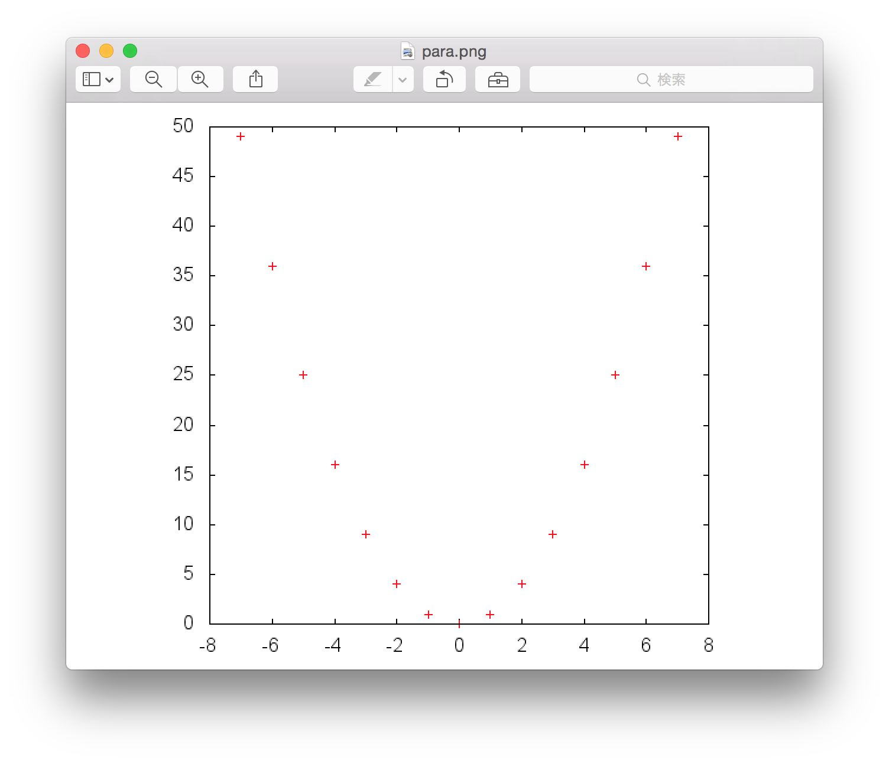

------------------------------------------------------------------------

[]()

オブジェクト指向プログラミング実習 課題２
=========================================

### この課題をクリアするには

1.  チーム全員がこのページの内容を理解していること．
2.  チームを代表して誰かメンバーがプロジェクト課題２を提出すること．
3.  (質疑セッションは課題3と一緒に行います．)

------------------------------------------------------------------------

トピック：継承
--------------

------------------------------------------------------------------------

**以下の質問に関して答えられるようにしておくこと．**

### 質問1

次のうちクラスの継承について誤っているものを選びなさい．

    (1) クラスAがクラスBを継承するとき，クラスAをクラスBのサブクラスと呼ぶ
    (2) あるクラスを継承するサブクラスが複数存在することもある
    (3) あるクラスのスーパークラスが複数存在することもある
    (4) サブクラスは，スーパークラスに定義されている変数やメソッドを引き継ぐ

------------------------------------------------------------------------

------------------------------------------------------------------------

### 質問2

``` {.program}
class X {
  X() { System.out.println("[X]");}          // 行1
  void a() { System.out.println("[x.a]");}   // 行2
  void b() { System.out.println("[x.b]");}   // 行3
}
class Y extends X {
  Y() { System.out.println("[Y]"); }          // 行4
  void a() { System.out.println("[y.a]"); }   // 行5
}
```

上記のようにクラスX,Yが宣言されている場合の，次のプログラムコードを実行した結果はどうなると思うか？

(1)

``` {.program}
X x = new X();
x.a();
x.b();
```

(2)

``` {.program}
Y y = new Y();
y.a();
y.b();
```

------------------------------------------------------------------------

### 質問3

``` {.program}
class X {
  X() { System.out.println("[X()]");}               // 行1
  X(int i) { System.out.println("[X(int i)]");}     // 行2
}
class Y extends X {
  Y() { System.out.println("[Y()]"); }              // 行3
  Y(int i) { System.out.println("[Y(int i)]"); }    // 行4
}
class Z extends Y {}
```

上記のようにクラスX,Yが宣言されている場合，次のプログラムコードを実行した結果はどうなると思うか？

``` {.program}
Y y0 = new Y();
Y y1 = new Y(10);
Z z = new Z();
```

------------------------------------------------------------------------

### 質問4

次のようにクラスA,B,Cが定義されている．

``` {.program}
 class A { } 
 class B extends A { } 
 class C { }
```

次の変数の宣言と代入で誤りがあるものを選びなさい．

    (1) A a = new A();
    (2) A a = new B();
    (3) A a = new C();
    (4) B b = new A();
    (5) B b = new B();
    (6) B b = new C();

------------------------------------------------------------------------

#### 例題

``` {.program}
// ファイルOmikuji.java
class Omikuji {
    int rand() {
    return (int) (Math.random() * 4);  // 0..3の乱数を返す．
    }
    String first() {
    return "運勢は";
    }
    String second() {
    switch(rand()) {
    case 0:
        return "凶";
    case 1:
        return "小吉";
    case 2:
        return "吉";
    default:
        return "大吉";
    }
    }
    String last() {
    return "です．";
    }
    void print() {
    System.out.println(first() + second() + last());
    }
}

// ファイルOmikujiTest.java
class OmikujiTest {
    public static void main(String[] args) {
    (new Omikuji()).print();
    }
}
```

#### 実行例:

``

``` {.interaction}
borage36:~ maeda$ java OmikujiTest
運勢は大吉です．
borage36:~ maeda$
```

#### 例題: first()をオーバーライドして表示を変える

``` {.program}
// ファイルOmikuji2.java
class Omikuji2 extends Omikuji {
    String first() {
    return "あなたの明日の運勢は";
    }
}

// ファイルOmikujiTest2.java
class OmikujiTest2 {
    public static void main(String[] args) {
    (new Omikuji2()).print();
    }
}
```

#### 実行例:

``

``` {.interaction}
borage36:~ maeda$ java OmikujiTest2
あなたの明日の運勢は凶です．
borage36:~ maeda$
```

Omikuji2は，Omikujiの機能をそのまま継承していて，
first()だけを変更している．

### 設問1

以下のプログラムを完成し，Omikuji2を継承して，second()だけを変更し，
運勢の表現を「アンラッキー」「ちょっとラッキー」「ラッキー」「大ラッキー」
に変えたクラスOmikuji3を作りなさい．

``` {.program}
// ファイルOmikuji3.java
class Omikuji3 extends Omikuji2 {
    String second() {
    「文1」
    }
}
```

Omikuji3を以下のOmikujiTest3でテストしなさい．

``` {.program}
// ファイルOmikujiTest3.java
class OmikujiTest3 {
    public static void main(String[] args) {
    (new Omikuji3()).print();
    }
}
```

#### 実行例:

``

``` {.interaction}
borage36:~ maeda$ java OmikujiTest3
あなたの明日の運勢はちょっとラッキーです．
borage36:~ maeda$
```

**Omikuji3.java を提出しなさい．**

### 設問2

同じくOmikuji2を継承し，
print()メソッドだけを変更して，表示を３行に分ける
ように変えたクラスOmikuji4を作りなさい．

``` {.program}
// ファイルOmikuji4.java
class Omikuji4 extends Omikuji2 {
    void print() {
        「プログラム2」
    }
}
```

以下のOmikujiTest4でテストしなさい．

``` {.program}
// ファイルOmikujiTest4.java
class OmikujiTest4 {
    public static void main(String[] args) {
    (new Omikuji4()).print();
    }
}
```

#### 実行例:

``

``` {.interaction}
borage36:~ maeda$ java OmikujiTest4
あなたの明日の運勢は
大吉
です．
borage36:~ maeda$
```

(Javaで改行コードを"\\n"あるいは'\\n'のように記述するのは
一部の環境でしか正しく動かないので避けること．)

**Omikuji4.java を提出しなさい．**

------------------------------------------------------------------------

#### 例題

以下は，関数f(x) =
xの値を，xを0〜4まで変えながら表示するプログラムである．

``` {.program}
// ファイルFun
class Fun {
    int f(int x) {
    return x;
    }
    void print() {
    for (int i = 0; i < 5; i++) {
        System.out.println(f(i));
    }
    }
}

// ファイルFunTest
class FunTest {
    public static void main(String[] args) {
    (new Fun()).print();
    }
}
```

#### 実行例:

``

``` {.interaction}
borage36:~ maeda$ java FunTest
0
1
2
3
4
borage36:~ maeda$
```

### 設問3

Funを継承したクラスFun2を作り，x^2^の値を
xを0〜4まで変えながら表示するプログラムを作りなさい．

``` {.program}
// ファイルFun
class Fun2 extends Fun {
    int f(int x) {
    「文3」 ;
    }
}
```

以下のFunTest2でテストしなさい．

``` {.program}
// ファイルFunTest2
class FunTest2 {
    public static void main(String[] args) {
    (new Fun2()).print();
    }
}
```

#### 実行例:

``

``` {.interaction}
borage36:~ maeda$ java FunTest2
0
1
4
9
16
borage36:~ maeda$
```

**Fun2.java を提出しなさい．**

------------------------------------------------------------------------

[]()

#### 例題: 汎用グラフクラス

下は， 最小限の変更で，いろいろなグラフを描けるようにした
GraphTemplateクラスである． (テスト用のmainメソッドも持っている．) ``

``` {.program}
// ファイルGraphTemplate.java
class GraphTemplate {
    void drawLine(int x, int y) {
        System.out.print(x + ":");
        for (int i = 0; i < y; i++) {
            System.out.print("*");
        }
        System.out.println();
    }
    void drawAll() {
        for (int x = start(); x <= end(); x++) {
            drawLine(x, fn(x));
        }
    }
    public static void main(String[] args) {
        (new GraphTemplate()).drawAll();
    }
    int fn(int x) {
        return 10;
    }
    int start() {
        return 1;
    }
    int end() {
        return 5;
    }
}
```

上のままでは5×10の長方形を描く．

#### 実行例:

(**太字**が入力) ``

``` {.interaction}
borage36:~ maeda$ java GraphTemplate
  1:**********
  2:**********
  3:**********
  4:**********
  5:**********
borage36:~ maeda$
```

fn, start, endメソッドをオーバーライドすることで
いろいろなグラフを描くクラスを作ることができる．

#### 例題: GraphTemplateの使用例

``

``` {.program}
// ファイルTriangleGraph.java
class TriangleGraph extends GraphTemplate {
  public static void main(String[] args) {
    (new TriangleGraph()).drawAll();
  }
  int fn(int x) {
    return x;
  }
}
```

#### 実行例:

``

``` {.interaction}
borage36:~ maeda$ java TriangleGraph
  1:*
  2:**
  3:***
  4:****
  5:*****
borage36:~ maeda$ 
```

### 設問4

以下のプログラムを完成し，GraphTemplateを継承して-7から7までの範囲で x
の2乗を描く クラスParabolaGraphを作りなさい．

``

``` {.program}
// ファイルParabolaGraph.java
class ParabolaGraph extends GraphTemplate {
  public static void main(String[] args) {
    (new ParabolaGraph()).drawAll();
  }
  int fn(int x) {
    「文4」 ;
  }
  int start() {
    「文5」 ;
  }
  int end() {
    「文6」 ;
  }
}
```

#### 実行例:

(**太字**が入力) ``

``` {.interaction}
borage36:~ maeda$ java ParabolaGraph
-7:*************************************************
-6:************************************
-5:*************************
-4:****************
-3:*********
-2:****
-1:*
0:
1:*
2:****
3:*********
4:****************
5:*************************
6:************************************
7:*************************************************
```

**ParabolaGraph.java を提出しなさい．**

### 設問5

ParabolaGraphを継承し，描画する関数や範囲はそのままで，
1行の表示だけを棒グラフでなく，gnuplotへの入力となる ``

``` {.interaction}
x座標  y座標
```

の形で出力する
ParabolaGraph2を作りなさい．drawLineメソッドだけをオーバーライドし， fn,
start, end, drawAllは定義しないようにすること．

以下には，メソッドdrawLine()の部分だけ書いてある．
「プログラム7」の部分を埋めなさい． ``

``` {.program}
// ファイルParabolaGraph2.javaの一部
    …
    void drawLine(int x, int y) {
       「プログラム7」
    }
    …
```

#### 実行例:

gnuplotを用いて，データを点として(線でつながず)プロットするスクリプトを
用意してある．

(**太字**が入力) ``

``` {.interaction}
borage36:~ maeda$ java ParabolaGraph2
-7 49
-6 36
-5 25
-4 16
-3 9
-2 4
-1 1
0 0
1 1
2 4
3 9
4 16
5 25
6 36
7 49
borage36:~ maeda$ java ParabolaGraph2 > para.dat
borage36:~ maeda$ ~maeda/oo/plot-dot.sh para.dat
borage36:~ maeda$ 
```

{width="50%"}

**ParabolaGraph2.java を提出しなさい．**

------------------------------------------------------------------------

[Top](#top)
