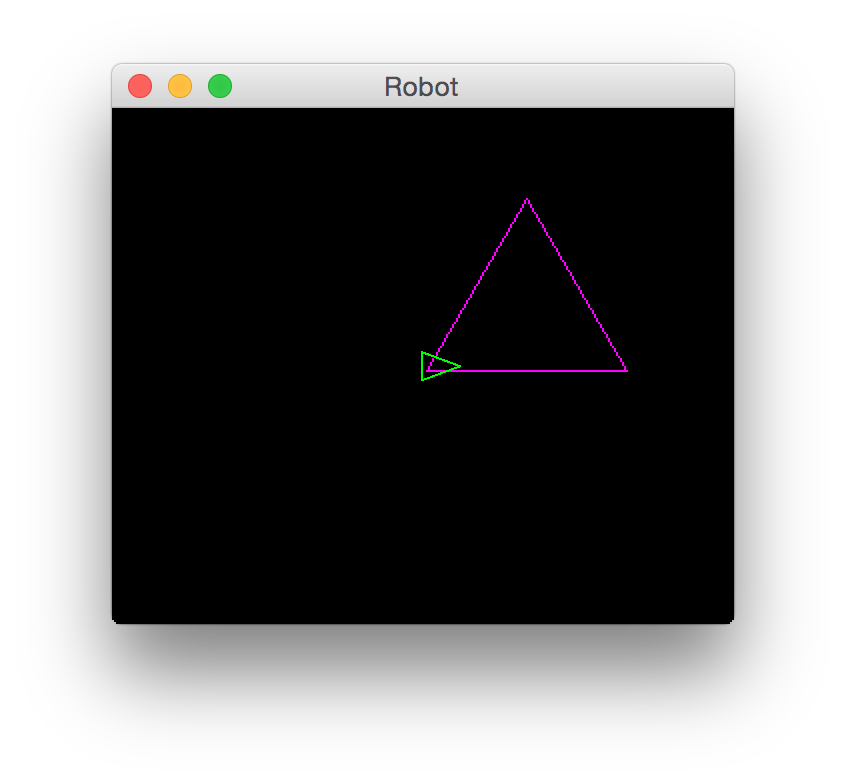
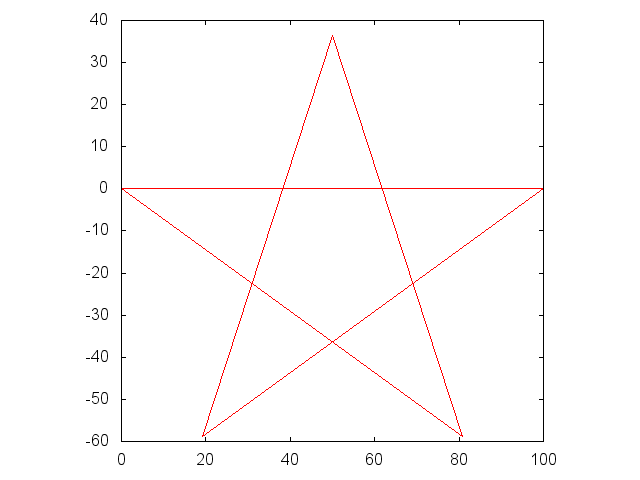
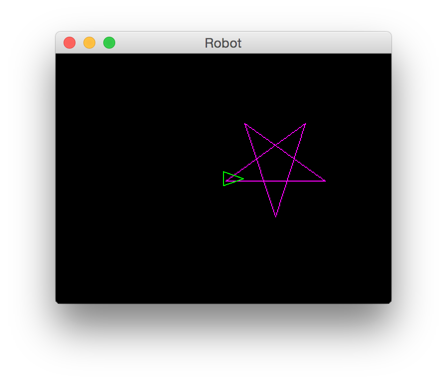
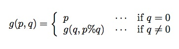

------------------------------------------------------------------------

[]()

オブジェクト指向プログラミング実習 課題１
=========================================

まずmanabaのコンテンツ「この授業の進め方」を読んで，
授業全体のルールを理解して下さい．

### この課題をクリアするには

1.  チーム全員がこのページの内容を理解していること．
2.  チームを代表して誰かメンバーがプロジェクト課題を提出すること．
3.  (出席している)チーム全員がmanabaの「課題１確認ドリル」を何回か受験すること．
4.  (出席している)チーム全員がmanabaの「課題１確認テスト（自由記述）」を受験すること．
5.  最後に，(出席している)チーム全員で教員のところに来て質疑セッションを行うこと．

また，1/12(木)のうちに課題をクリアするには，さらに
オプション問題を解く必要があります．

------------------------------------------------------------------------

トピック：オブジェクト指向の基本概念
------------------------------------

------------------------------------------------------------------------

### 質問

まず用語の復習をしておこう．
次の空欄【1】～【7】にあてはまる言葉は，下の選択肢(a)～(i)のうちどれが適切か．
**答えられるようにしておくこと．**

-   Java言語は【 1
    】指向型の言語であり，クラスを組み合わせてプログラムを作りあげる．クラスは【
    1 】の属性(データ)や機能(動作)を定義したものである．
-   クラス定義の中で【 1 】の持つ属性(データ)を定義したものを【 2
    】とよび，機能(動作)を定義したものを【 3 】とよぶ．
-   プログラムコードの中でnewを使って，クラスの【 4
    】を生成することができる．
-   変数に格納できるもの（【 2
    】の引数の型に指定できるもの）は，intやdoubleなどの【 5 】型と，【 4
    】 のメモリ中の場所を表わす【 6 】型のどちらかである．
-   【 6 】型の変数に，場所の情報が何も入っていない状態を【 7
    】というキーワードで表現する．

``` {.program}
(a)参照 (b)フィールド (c)変数 (d)関数 (e)オブジェクト (f)メソッド (g)null
(h)基本 (i)インスタンス (j)インターフェース
```

------------------------------------------------------------------------

### 設問1

以下のRectangleクラスは，長方形の左下の座標(left, bottom)と 幅width,
高さheightをフィールドに持っている． ``

``` {.program}
public class Rectangle {
    int left;   // 左端の座標
    int bottom; // 下端の座標
    int width;  // 幅
    int height; // 高さ
   
    Rectangle(int left, int bottom, int width, int height) {
    「(1)」
    }
    void printRectangle() {
        System.out.print("左下(" + left + ", " + bottom + "), ");
        System.out.println("右上(" + (left + width)  + ", " + (bottom + height) + ")");
    }
    int getArea() {
        // 面積を返す
        return 「(2)」;
    }

    boolean isLarger(Rectangle r) {
        // thisの面積がrの面積より大きければ true ，そうでなければ falseを返す．
        return 「(3)」;
    }
   
    boolean contains(Point p) {
        // pが長方形の中にあれば(端の線上にある場合も含む) true を返す．
        return 「(4)」;
    }
}
```

``

``` {.program}
// ファイルPoint.java
public class Point {
    int x, y;
    Point(int x, int y) {
        this.x = x;
        this.y = y;
    }
    void printPoint() {
        System.out.println("座標(" + x + ", " + y + ")");
    }
}
```

上記のプログラムの「(1)」〜「(4)」を埋めてクラスを完成させなさい．以下のプログラムを使ってテストしなさい．
``

``` {.program}
// ファイルRectangleTest.java
public class RectangleTest {
    public static void main(String[] args) {
        Rectangle r1 = new Rectangle(5, 3, 10, 20);
        Rectangle r2 = new Rectangle(9, 13, 12, 10);
        Point[] p = {new Point(4, 30), new Point(6, 30), new Point(20, 30),
                     new Point(4, 20), new Point(6, 20), new Point(20, 20),
                     new Point(4, 2), new Point(6, 2), new Point(20, 2)};
        System.out.print("r1: ");
        r1.printRectangle();
        System.out.print("r2: ");
        r2.printRectangle();

        System.out.print("r1はr2より");
        if (r1.isLarger(r2)) {
            System.out.println("大きい．");
        } else {
            System.out.println("大きくない．");
        }

        for (int i = 0; i < p.length; i++) {
            p[i].printPoint();
            if (r1.contains(p[i])) {
                System.out.println("r1の中．");
            }
            if (r2.contains(p[i])) {
                System.out.println("r2の中．");
            }
        }
    }
}
```

#### 実行例

(**太字**が入力) ``

``` {.interaction}
balsam26:~ maeda$ java RectangleTest
r1: 左下(5, 3), 右上(15, 23)
r2: 左下(9, 13), 右上(21, 23)
r1はr2より大きい．
座標(4, 30)
座標(6, 30)
座標(20, 30)
座標(4, 20)
座標(6, 20)
r1の中．
座標(20, 20)
r2の中．
座標(4, 2)
座標(6, 2)
座標(20, 2)
balsam26:~ maeda$
```

**完成したRectangle.javaを提出しなさい．
また，プログラムの動作や用語に関する質問に答えられるようにしておくこと．**

質問の例(これだけとは限らない):

-   フィールドとは？ 上のプログラムで言うとたとえばどれ？
-   メソッドとは？ 上のプログラムで言うとたとえばどれ？
-   コンストラクタとは？ 上のプログラムで言うとたとえばどれ？
-   配列のlengthについて説明しなさい．

------------------------------------------------------------------------

[]()

### 設問2

「左を向け」「前へ進め」などの命令によって動くロボットを考える．
ロボットが動くと軌跡が残り，結果として図形を描くことができるものとする．

たとえば，以下のようなプログラムで，三角形が描けるようにしたい． ``

``` {.program}
public class Triangle {
    public static void main(String[] args) {
        SimpleRobot robot = new SimpleRobot();
        for (int i = 0; i < 3; i++) {
            robot.moveForward(100);  // 「前へ100歩進め」
            robot.turnLeft(120);     // 「左へ120度回れ」
        }
    }
}
```

#### 実行結果のイメージ

{width="50%"}

実際にこのように実行できるサンプルを用意してある． ``

``` {.interaction}
balsam26:~ maeda$ java -cp ~maeda/oo Polygon 3
```

を実行すると，上記のような図形が描画される．まだ説明していない
部分を含んでいるが，Polygon.javaのソースも`~maeda/oo/` に
置いてあるので参考にしてよい．

(また、`~maeda/oo/`ディレクトリの内容を
[oo.zip](oo.zip)にまとめたので、ダウンロードして利用してもよい。)

ロボットを実現するクラスとして，以下のようなものを考える． ``

``` {.program}
public class SimpleRobot  {
    // ロボットの内部状態を表すデータ
    double x, y;    // 現在の座標．
    double heading; // 角度(0〜360)．0は東(右)，90は北(上)を表す．

    public SimpleRobot() {
        x = y = 0.0;
        heading = 0.0;
    }
    public void setHeading(double heading) {
        this.heading = heading;
    }
    public void turnLeft(double degree) {
        setHeading(heading + degree);
    }
    public void turnRight(double degree) {
        turnLeft(-degree);
    }
    public void moveTo(double x, double y) {
        this.x = x;
        this.y = y;
    }
    public void moveForward(double step) {
        double radian = heading / 180.0 * Math.PI;
        moveTo(this.x + Math.cos(radian) * step,
               this.y + Math.sin(radian) * step);
    }
}
```

このSimpleRobotクラスとTriangleクラスをコンパイルして実行すると，
ロボットの状態は指示通りに（三角形を描くように）変化するが，
何も出力されないので，描かれた図形を見ることができない．

SimpleRobotクラスを書き換えて，xまたはyの座標が変化するたびに ``

``` {.interaction}
移動前のx座標  移動前のy座標
移動後のx座標  移動後のy座標
```

の2行を出力するようにしなさい(x座標とy座標の間は空白で区切ること)．

書き換えたSimpleRobotを用いて，正立した(尖った先が上を向いた)星形(五芒星形)を描くクラスStar
を作りなさい．

#### 実行例

(**太字**が入力) ``

``` {.interaction}
balsam26:~ maeda$ java Star
0.0 0.0
100.0 0.0
100.0 0.0
19.098300562505273 -58.77852522924732
19.098300562505273 -58.77852522924732
50.0 36.32712640026804
50.0 36.32712640026804
80.90169943749477 -58.77852522924731
80.90169943749477 -58.77852522924731
0.0 -2.8421709430404007E-14
balsam26:~ maeda$ java Triangle
0.0 0.0
100.0 0.0
100.0 0.0
50.00000000000002 86.60254037844388
50.00000000000002 86.60254037844388
-2.1316282072803006E-14 2.8421709430404007E-14
balsam26:~ maeda$ 
```

(誤差の範囲内で，表示される数値や桁数が違ってもかまわない．)

この形式の出力を，gnuplotを利用して画面に表示させるスクリプトを用意したので
テストに利用すると良い．以下のような出力が得られれば正解である．

#### 実行例

(**太字**が入力) ``

``` {.interaction}
balsam26:~ maeda$ java Star > star.dat
balsam26:~ maeda$ ~maeda/oo/plot.sh star.dat
```

{width="50%"}

(参考:
「`java -cp ~maeda/oo Polygon 5 2`」を実行すると，下記のような出力が得られる．この方向では正解とみなさない．)

{width="50%"}

------------------------------------------------------------------------

**書き換えたSimpleRobot.javaとStar.javaを提出しなさい．
また，プログラムに関する質問に答えられるようにしておくこと．**

質問の例(これだけとは限らない):

-   どういう考え方でSimpleRobotを書き換えたか？
-   Math.PIとは何か説明しなさい．

[]()

### 設問3

以下は，分数を表すクラスRatio(レシオ)で，加減乗除のためのメソッドadd,
sub, multiply,
divideを持っている．これらのメソッドは，分数と分数の演算の他，分数と整数についても同じ名前のメソッドを定義してある．

(分母が0や負になる場合は考慮しなくて良いものとする．) ``

``` {.program}
public class Ratio {
    private long num;    // 分子
    private long denom;  // 分母

    public Ratio(long num, long denom) {
        if (denom < 0) {
            num *= -1;
            denom *= -1;
        }
        long g = gcd(num, denom);    // 約分するために最大公約数を求める．
        this.num = num / g;
        this.denom = denom / g;
    }
    // クラスの外には見せないメソッド
    private long gcd(long p, long q) {
      // 最大公約数を計算する．
      「(1)」
    }
    private Ratio multiply(long num, long denom) {
        long n = 「(2)」 ;
        long d = 「(3)」 ;
        return new Ratio(n, d);
    }
    private  Ratio add(long num, long denom) {
        long n = 「(4)」 ;
        long d = 「(5)」 ;
        return new Ratio(n, d);
    }

    // 公開するメソッド
    public double doubleValue() {
        return (double)num / (double)denom;
    }

    public String toString() {
        // 文字列に変換する
        if (denom == 1) {
            return Long.toString(num);
        } else {
            return num + "/" + denom;
        }
    }
    public boolean equals(Object obj) {
    // objがthisと等しければtrue，さもなければfalse
        if (obj instanceof Ratio) {
            Ratio r = (Ratio)obj;
            return denom == r.denom && num == r.num;
        } else {
            return false;
        }
    }

    // 分数どうしの加減乗除
    public Ratio add(Ratio r) {
        // thisとrを足した結果のRatioを作って返す
        return add(r.num, r.denom);
    }
    public Ratio subtract(Ratio r) {
        // thisからrを引いた結果のRatioを作って返す
        return 「(6)」;          // addを使う．
    }
    public Ratio multiply(Ratio r) {
        // thisとrをかけた結果のRatioを作って返す
        return multiply(r.num, r.denom);
    }
    public Ratio divide(Ratio r) {
        // thisをrで割った結果のRatioを作って返す
        return 「(7)」;          // multiplyを使う．
    }

    // 整数との加減乗除
    public Ratio add(long i) {
        return add(i, 1);
    }
    public Ratio subtract(long i) {
        return 「(8)」;
    }
    public Ratio multiply(long i) {
        return multiply(i, 1);
    }
    public Ratio divide(long i) {
        return 「(9)」;
    }
}
```

上記のプログラムの「(1)」〜「(9)」を埋めてクラスを完成させなさい．以下のプログラムを使ってテストしなさい．

なお，2つの非負の整数p, qの 最大公約数g(p,
q)は，以下のような再帰的な関数で計算することができる．

 ``

``` {.program}
public class RatioTest {
    public static void main(String[] args) {
        Ratio r1 = new Ratio(1, 2); // 1/2
        Ratio r2 = new Ratio(1, 4); // 1/4

        Ratio r3 = r1.multiply(r2); // (1/2) * (1/4)
        System.out.println(r3);

        Ratio r4 = r1.add(r2);    // (1/2) + (1/4)
        System.out.println(r4);

        Ratio r5 = r1.subtract(r2);   // (1/2) - (1/4)
        System.out.println(r2);

        Ratio r6 = r1.divide(r2);   // (1/2) / (1/4)
        System.out.println(r6);

        Ratio r7 = r2.multiply(3).divide(2).add(1).multiply(2).subtract(1);
        // r7 = ((1/4) * 3 / 2 + 1) * 2 - 1
        System.out.println(r7);
    }
}
```

#### 実行例

(**太字**が入力) ``

``` {.interaction}
balsam26:~ maeda$ java RatioTest
1/8
3/4
1/4
2
7/4
balsam26:~ maeda$ 
```

**完成したRatio.javaを提出しなさい．
また，プログラムの動作や用語に関する質問に答えられるようにしておくこと．**

質問の例(これだけとは限らない):

-   オーバーロードとはどういう意味か？
    また，それを上のプログラムに関して説明しなさい．
-   RatioTest中のaddメソッドの呼び出しそれぞれに対して，実際に呼び出されるメソッドはどれ？

------------------------------------------------------------------------

### 1/12(木)に課題をクリアするためのオプション問題

下のプログラムは，Ratioを使って無理数を近似するプログラムである．
(longやdoubleの桁数の制限があるため，繰り返し回数をこれ以上増やしても
精度はよくならない．)

「」内を埋めて以下のプログラムを完成させなさい． ``

``` {.program}
public class RatioTest2 {
    static Ratio zero = new Ratio(0, 1);
    static Ratio one = new Ratio(1, 1);
    static Ratio two = new Ratio(2, 1);
    static Ratio fact(int n) {
        // n!をRatio型で返す
        Ratio r = one;
        for (int i = n; i > 0; i--) {
            r = r.multiply(new Ratio(i, 1));
        }
        return r;
    }
    static void test1() {
        Ratio e = zero;
        for (int i = 0; i < 14; i++) {
            // e = e + ???
            e = e.add(「(A)」) ;
        }
        System.out.println(e.doubleValue());
    }
    static void test2() {
        Ratio a = two;
        Ratio d = one;
        for (int n = 1; n < 14; n++) {
            // d = d * n / (2*n + 1)
            d = 「(B)」 ;
            // a = a + 2*d
            a = 「(C)」 ;
        }
        System.out.println(a.doubleValue());
    }
    static void test3() {
        Ratio x = two;
        for (int i = 0; i < 22; i++) {
            // x = 2 + ???
            x = two.add(「(D)」) ;
        }
        System.out.println(x.subtract(one).doubleValue());
    }
    public static void main(String[] args) {
        test1();
        System.out.println("-------------------------");
        test2();
        System.out.println("-------------------------");
        test3();
    }
}
```

#### 実行例

(**太字**が入力) ``

``` {.interaction}
balsam26:~ maeda$ java RatioTest
2.718281828446759
-------------------------
3.141537993173476
-------------------------
1.4142135623730951
balsam26:~ maeda$ 
```
