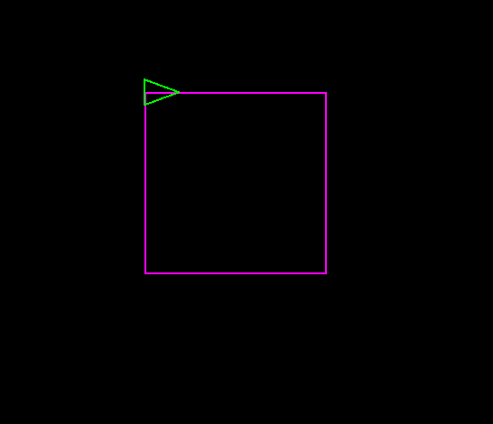
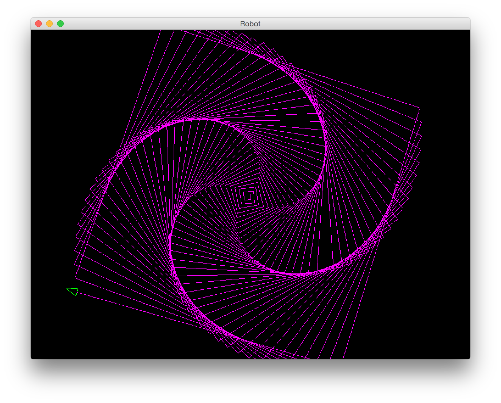

[]()

オブジェクト指向プログラミング実習 個人課題2
============================================

**(注意: 個人課題では，他の人の作った結果を利用しないこと!)**

スタック指向スクリプト言語
--------------------------

以下のプログラムは，[課題５](stack-and-tree.html)のJCalc
と似ているが，以下の点が異なっている．

-   スタックに積む数値はintやRatioでなくdoubleである．
-   トークンを読んですぐ実行するのではなく，
    parseメソッドでいったん区切り記号"。"までのトークン列をすべて読んで，
    トークンのリストを持つ特殊なトークン(Programのインスタンス)を作り，
    それからProgramのrunメソッドでトークンをすべて解釈して実行している．
-   計算機の状態を表すデータとして，値を入れるスタック stack の他，
    プログラムを積む pstack がある．
    これと，命令辞書opsをまとめてState型のインスタンスの中に入れてある．
-   "「" と "」" の間のトークンの列は，Programとしてpstackに積む．
    "実行する" 命令を使うと，pstackからProgramをポップし，
    runメソッドを呼び出して実行する．
-   "と", "を", "から" など，いくつかの単語はNoOp命令と対応付けて
    無視するようになっている．

``

``` {.program}
import java.util.*;

public class LCalc {
    abstract class Op {
        abstract public String opName();
        abstract public void exec();
    }
    class PrintOp extends Op {
        public String opName() { return "="; }
        public void exec() {
            for (double p : state.stack) {
                System.out.println(p);
            }
        }
    }
    abstract class BinOp extends Op {
        abstract public double op(double rand1, double rand2);
        public void exec() {
            double v2 = state.stack.pop();
            double v1 = state.stack.pop();
            state.stack.push(op(v1, v2));
        }
    }
    class AddOp extends BinOp {
        public String opName() { return "足す"; }
        public double op(double rand1, double rand2) { return rand1 + rand2; }
    }
    class SubOp extends BinOp {
        public String opName() { return "引く"; }
        public double op(double rand1, double rand2) { return rand1 - rand2; }
    }
    class MulOp extends BinOp {
        public String opName() { return "かける"; }
        public double op(double rand1, double rand2) { return rand1 * rand2; }
    }
    class DivOp extends BinOp {
        public String opName() { return "割る"; }
        public double op(double rand1, double rand2) { return rand1 / rand2; }
    }
    class NoOp extends Op {
        public String opName() { return "noop"; }
        public void exec() {
            // 何もしない
        }
    }
    class RunOp extends Op {
        public String opName() { return "実行する"; }
        public void exec() {
            state.pstack.pop().run();
        }
    }

    interface Token {
        abstract void interpret(); // トークンを解釈し，実行する
    }
    class Number implements Token {
        private double num;
        public Number(double num) { this.num = num; }
        public void interpret() {
            state.stack.push(num); // 数値を解釈すると，値スタックに積む
        }
        public String toString() { return Double.toString(num); }
    }
    class Name implements Token {
        private String name;
        public Name(String name) { this.name = name; }
        public void interpret() {
            if (state.ops.containsKey(name)) {
                state.ops.get(name).exec(); // 名前を解釈すると，命令辞書を引いて命令を実行する
            } else {
                System.out.println("エラー: 誤ったトークン: " + name);
            }
        }
        public String toString() { return name; }
    }
    class Program implements Token {
        private List<Token> prog;
        public Program(List<Token> prog) { this.prog = prog; }
        public void interpret() {
            state.pstack.push(this); // プログラムを解釈すると，自分をプログラムスタックに積む
        }
        List<Token> inspect() { return prog; }
        void run() {
            for (Token t : prog) {
                t.interpret();  // トークン列をすべて解釈する
            }
        }
        public String toString() {
            String result = "「 ";
            for (Token t : prog) { result += t.toString() + " "; }
            result += "」";
            return result;
        }
    }

    // 命令一覧表
    Op[] optable = {new AddOp(), new SubOp(), new MulOp(), new DivOp(), new PrintOp(), new RunOp()};
    // 無視するトークン
    String[] noopTable = {"と", "を", "から", "で", "の", "回", "歩", "度"};

    // マシンの状態
    class State {
        Deque<Double> stack;    // 値スタック
        Deque<Program> pstack;  // プログラムスタック
        Map<String, Op> ops;    // 単語辞書
        State() {
            stack = new LinkedList<Double>();
            pstack = new LinkedList<Program>();
            ops = new HashMap<String, Op>();
        }
    }
    State state;
    Scanner scanner;
    LCalc() {
        state = new State();
        scanner = new Scanner(System.in);
        // 辞書に命令語を登録する．
        for (Op op : optable) {
            state.ops.put(op.opName(), op);
        }
        Op noop = new NoOp();
        for (String n : noopTable) {
            state.ops.put(n, noop);
        }
    }
    Program parse(String endToken) {
        List<Token> list = new LinkedList<Token>();
        while (! scanner.hasNext(endToken)) {
            if (scanner.hasNext("「")) { // 次のトークンが"「”ならば
                scanner.next();     // "「"を読み飛ばす．
                Program subList = parse("」"); // "」"まで列にする
                list.add(subList);
            } else if (scanner.hasNextDouble()) {
                list.add(new Number(scanner.nextDouble()));
            } else {
                list.add(new Name(scanner.next()));
            }
        }
        scanner.next();     // endTokenを読み飛ばす．
        return new Program(list);
    }
    public void run() {
        while (scanner.hasNext()) {
            try {
                Program p = parse("。"); // "。"まで列にする
                System.out.println("入力: " + p.toString());
                p.run();   // 列を解釈する
            } catch (Exception e) {
                System.out.println("エラー");
                e.printStackTrace(System.out);
            }
        }
        System.out.println("終了。");
        System.exit(0);
    }
    public static void main(String[] args) {
        new LCalc().run();
    }
}
       
```

#### 実行例:

(下線が入力, 緑字は注釈．) ``

``` {.interaction}
$ java LCalc
2 と 3 を 足す 2 で 割る = 。
入力: 「 2.0 と 3.0 を 足す 2.0 で 割る = 」
2.5
2 を かける 「 10 で 割る 」 を 実行する = 。
入力: 「 2.0 を かける 「 10.0 で 割る 」 を 実行する = 」
0.5
^D            ← 行の先頭でControl-Dを入力
終了。
$ 
```

------------------------------------------------------------------------

### ロボット言語Stacola

[以前](abstract_class_and_interface.html)に作ったロボットを制御する
スタック指向言語(Stack Oriented Language)を作ろう．

まず，ロボットの表示のためのRobotViewインターフェースと，
内部状態を表すRobotModelクラスを，以前と同じまま再掲しておく． ``

``` {.program}
interface RobotView {
    public void turn(double oldHeading, double newHeading);
    public void move(double oldX, double oldY,
                     double newX, double newY);
}
```

``

``` {.program}
public class RobotModel  {
    // ロボットの内部状態を表すデータ
    double x, y;    // 現在の座標．
    double heading; // 角度(0〜360)．0は東(右)，90は北(上)を表す．
    RobotView view;

    public RobotModel() {
        x = y = 0.0;
        heading = 0.0;
    }
    public void setView(RobotView view) {
        this.view = view;
    }
    public void setHeading(double heading) {
        view.turn(this.heading, heading);
        this.heading = heading;
    }
    public void turnLeft(double degree) {
        setHeading(heading + degree);
    }
    public void turnRight(double degree) {
        turnLeft(-degree);
    }
    public void moveTo(double x, double y) {
        view.move(this.x, this.y, x, y);
        this.x = x;
        this.y = y;
    }
    public void moveForward(double step) {
        double radian = heading / 180.0 * Math.PI;
        moveTo(this.x + Math.cos(radian) * step,
               this.y + Math.sin(radian) * step);
    }
}
```

RobotViewの実装としては，ScreenViewを用いることとしよう．
ソースコードは省略するが，以前と同じようにコンパイル時と実行時に
「` -cp ~maeda/oo`」とすることで利用できる．
(面倒ならば，\~maeda/oo/Screen\*.class
をコピーして使ってもよい．javaコマンドやjavacコマンドの「-cp
フォルダ1:フォルダ2:...」オプションは，クラスを探す場所(class
path)を指定するオプションである．)

利用する手順をおさらいしておくと，以下のようにすればよいのだった．

1.  RobotModelのインスタンスrobotを作り，
2.  ScreenViewのインスタンスviewを作り，
3.  robot.setView(view)する．

あとは，robotに対してmoveForward, turnLeftなどのメソッドを用いれば，
画面上のロボットがその通りに動く．

設問(基本レベル): ロボット操作命令と繰り返し命令
------------------------------------------------

LCalcに次の命令を加えてロボット操作言語としたクラスStacolaを作りなさい．

1.  "進む" (ForwardOp) -
    スタックから数値をポップし，その数だけロボットを前にすすめる
2.  "右へ回る" (RightOp) -
    スタックから数値をポップし，その数だけロボットを右に回転させる
3.  "左へ回る" (LeftOp) -
    スタックから数値をポップし，その数だけロボットを左に回転させる
4.  "繰り返す" (RepeatOp) -
    プログラムスタックからProgramを，スタックから数値をポップし，その数だけ繰り返しProgramのrunを呼び出す

#### 実行例:

(下線が入力, 緑字は注釈．) ``

``` {.interaction}
$ java Stacola  場合によってはjava -cp ~maeda/oo:. Stacolaとする必要がある
「 100 歩 進む 90 度 右へ回る 」 を 4 回 繰り返す 。 
入力: 「 「 100.0 歩 進む 90.0 度 右へ回る 」 を 4.0 回 繰り返す 」
「 「 100 歩 進む 90 度 右へ回る 」 を 4 回 繰り返す 5 度 右へ回る 」 を 72 回 繰り返す 。
入力: 「 「 「 100.0 歩 進む 90.0 度 右へ回る 」 を 4.0 回 繰り返す 5.0 度 右へ回る 」 を 72.0 回 繰り返す 」
^D            ← 行の先頭でControl-Dを入力
終了。
$ 
```

上記の２行で，それぞれ以下のような図形が描かれるはずである．

{width="50%"}

{width="50%"}

**Stacola.javaを提出しなさい．**

すべてのチーム課題に加えて，基本レベルまで解答すれば合格とする．

------------------------------------------------------------------------

設問(発展レベル)
----------------

基本レベルに加えて，Stacolaに次の命令を加えたSuperStacolaを作りなさい．

1.  "余り" (ModOp) -
    スタック上の2つの数値yとxをポップする(先に積まれたのがx，スタックのトップにあったのがyとする)．x
    と yの小数点以下を切り捨てて，x/yの余り(つまり x %
    y)を計算し，doubleとしてプッシュする．小数点以下を切り捨てる際には，longに変換してよい．
2.  "選ぶ" (IfOp) - プログラムスタックから２つのProgram
    BとAをポップする(先に積まれたのがA，スタックのトップにあったのがBとする)．
    スタックから数値nをポップする．nが0でないならAを，0ならBを実行する．
3.  "より大きい" (GtOp) -
    スタックから2つの数値BとAをポップする(先に積まれたのがA，スタックのトップにあったのがBとする)．AがBより大きいなら1.0を，そうでなければ0.0をスタックに積む．

    同様に，"より小さい" (LtOp), "等しい"
    (EqOp)もそれぞれ比較を行って1.0か0.0を積む．

    (浮動小数点数だが，単純に==で比較してよいこととする．)

4.  "コピー" (DupOp) -
    スタックから数値をポップし，その数値を2回スタックに積む．
5.  "捨てる" (PopOp) - スタックから数値をポップして捨てる．

**SuperStacola.javaを提出しなさい．**(SuperStacola.javaを提出する場合，Stacola.javaは提出しなくてよい．)

#### 実行例:

(下線が入力, 緑字は注釈．) ``

``` {.interaction}
$ java Stacola  場合によってはjava -cp ~maeda/oo:. Stacolaとする必要がある
0  「 1 を 足す コピー 2 余り 0 と 等しい 「  = 」 「  」 選ぶ 」 10 回 繰り返す 。
入力: 「 0.0 「 1.0 を 足す コピー 2.0 余り 0.0 と 等しい 「 = 」 「 」 選ぶ 」 10.0 回 繰り返す 」
2.0
4.0
6.0
8.0
10.0
```

上記をすべて実現した場合はB以上を与える．
部分的に動いている場合は，どこまで動いているか明記すること．

------------------------------------------------------------------------

設問(高度レベル)
----------------

発展レベルに加えて，SuperStacolaに次の命令を加えたHyperStacolaを作りなさい．

-   "定義する" (DefOp) -
    プログラムスタックから2つのプログラムnamePartとbodyをポップする(先に積まれたのがnamePart,
    スタックのトップがbodyとする)．
    namePartは，名前ひとつから成るトークン列とする．たとえば，

         「 名前X 」 「 本体1  本体2  」 定義する

    のようにこのコマンドを実行した場合，namePartは「 名前X 」， bodyは「
    本体1 本体2 」となる． namePart内の名前(例では"名前X")を解釈すると，
    bodyのトークン列(例では「 本体1 本体2 」)が解釈されるように
    命令辞書に命令をputする．(ヒント: execされるとrunする命令を作る必要がある．)

**HyperStacola.javaを提出しなさい．**(HyperStacola.javaを提出する場合，Stacola.java,
SuperStacola.javaは提出しなくてよい．)

部分的に動いている場合は，どこまで動いているか明記すること．

#### 実行例:

(下線が入力, 緑字は注釈．) ``

``` {.interaction}
$ java SuperStacola HyperStacola  場合によってはjava -cp ~maeda/oo:. HyperStacolaとする必要がある
「 平均 」 「 足す 2 で 割る 」 と 定義する 。
入力: 「 「 平均 」 「 足す 2.0 で 割る 」 と 定義する 」
5 と 9 の 平均 = 捨てる 。
入力: 「 5.0 と 9.0 の 平均 = 捨てる 」
7.0
「 自乗 」 「 コピー と かける 」 と 定義する 。
入力: 「 「 自乗 」 「 コピー と かける 」 と 定義する 」
7 の 自乗 = 。
入力: 「 7.0 の 自乗 = 」
49.0
捨てる 。
入力: 「 捨てる 」
「 階乗 」
「 コピー と 0 等しい
    「 捨てる 1 」
    「 コピー から 1 を 引く 階乗 かける 」
   選ぶ 」
と 定義する 。

入力: 「 「 階乗 」 「 コピー と 0.0 等しい 「 捨てる 1.0 」 「 コピー から 1.0 を 引く 階乗 かける 」 選ぶ 」 と 定義する 」
5 の 階乗 = 。

入力: 「 5.0 の 階乗 = 」
120.0


「 うず 」
  「 コピー 500 より大きい
       「 捨てる 」
       「 89 度 右へ回る
         コピー 歩 進む
         3 を 足す うず 」
     選ぶ 」
と 定義する 。
入力: 「 「 うず 」 「 コピー 500.0 より大きい 「 捨てる 」 「 89.0 度 右へ回る コピー 歩 進む 3.0 を 足す うず 」 選ぶ 」 と 定義する 」
10 うず 。

入力: 「 10.0 うず 」
^D            ← 行の先頭でControl-Dを入力
終了。
$ 
```

{width="50%"}
